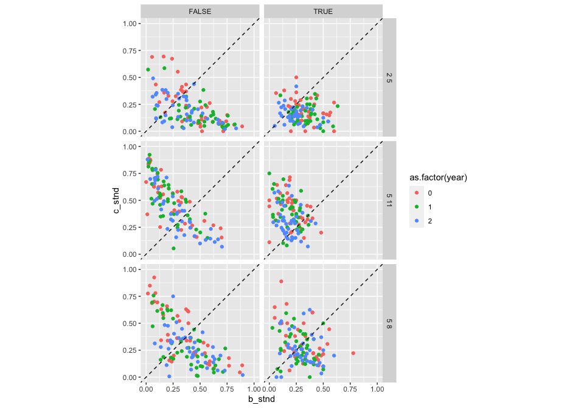
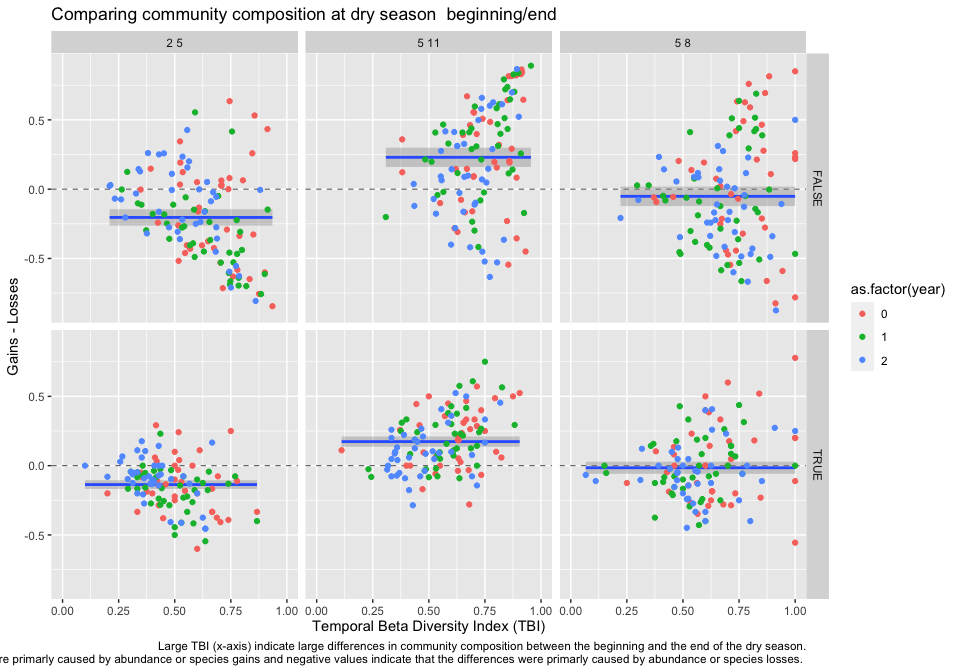
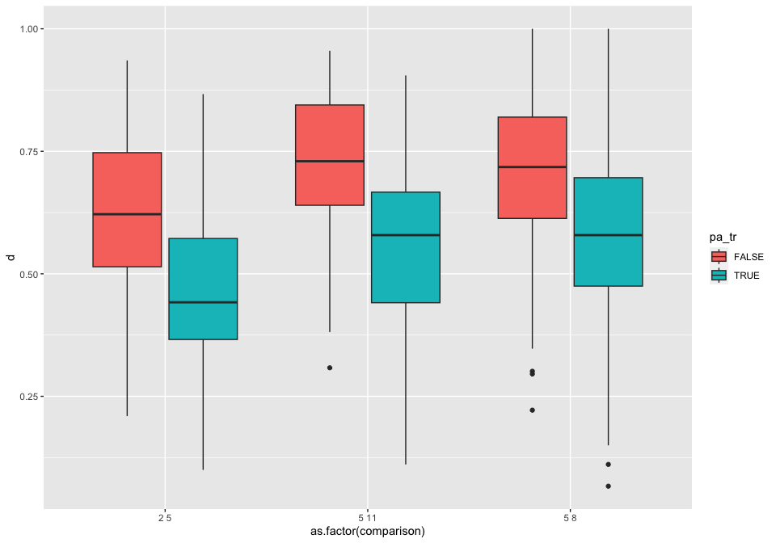
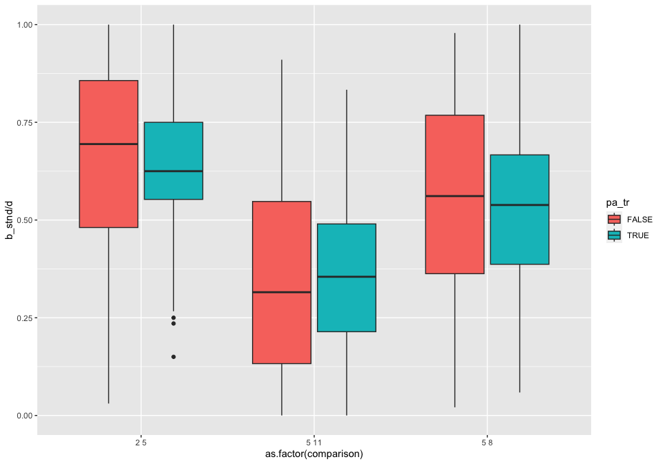

Beta-diversity index
================

``` r
drake::loadd(catch_info)
drake::loadd(refuge_info)
drake::loadd(occasion_info)
drake::loadd(species_info)
```

We focus only on the differences between beginning and end of the dry
season. We can see that in some cases there is quite a large difference
between the community composition at the beginning and the end

``` r
catch_standard <- catch_info %>%
 # standardise replicate sampling
  group_by(refuge, occasion, gear, species) %>%
  summarise(
    # Mean not appropriate as some surveys came empty even when they were
    # performed. For analysis need to calculate number of samplings performed
    # and standardise using that rather than the mean
    across(c(no_fish, total_weight), ~round(mean(., na.rm = T)* 8)), 
    .groups = "drop")


# Refuge 15 in 2013 was too dry to sample so it is removed
catch_wide <- catch_standard %>%
  # Convert to a matrix
  pivot_wider(id_cols = c("refuge", "occasion", "gear"), 
              names_from = "species", 
              values_from = "no_fish") %>%
  # fill un-sampled species to zero
  mutate(across(where(is.numeric), tidyr::replace_na, replace = 0)) %>%
  select(!starts_with("sp"), starts_with("sp")) %>%
  # Only Gill net 
  filter(gear == "GN")

occasion_simple <- occasion_info %>%
  mutate(year = lubridate::year(date),
         month = lubridate::month(date), 
         season = if_else(month %in% c(2,5), "dry", "wet"),
         across(c("month", "year"), as.character)) %>%
  select(occasion, year, season, month) %>%
  distinct() %>%
  mutate(year = (1:n() - 1) %/% 4) 

catch_full <- occasion_simple %>%
  right_join(catch_wide, by = "occasion") %>%
  group_by(year, season, month, refuge) %>%
  summarise(across(starts_with("sp"), sum), .groups = "drop") %>%
  # Make sure samplings with zero fish are included
  filter(!(refuge == "fr15" & year == 0), 
         year < 3) %>%
  arrange(year, refuge) 

change_matrices <- catch_full %>%
  split(.$month) %>%
  map(~select(., -(year:refuge))) %>%
  map(as.matrix)

combinations <- list(
  `2.5` = c("2", "5"), 
  `5.8` = c("5", "8"), 
  `5.11` = c("5", "11")
)

type <-  list(presence_absence = TRUE, abundance = FALSE)

tbi <- cross2(combinations, type) %>%
  map(function(x){
    adespatial::TBI(mat1 = change_matrices[[x[[1]][1]]], 
                    mat2 = change_matrices[[x[[1]][2]]], 
                    nperm = 99, test.BC = TRUE,
                    test.t.perm = T, save.BC = T, 
                    method = "%difference", pa.tr = x[[2]]) 
  })

type_combinations <- cross2(combinations, type) %>%
  map_df(~tibble(comparison = paste(.[[1]][1], .[[1]][2], collapse = "."), 
                 pa_tr = .[[2]]), .id = "type")

tbi_df <- tbi %>%
  map_df(function(x){
    p <- x$TBI
    bc <- x$BC
    x$BCD.mat %>%
      as_tibble() %>%
      set_colnames(c("b_stnd", "c_stnd", "d", "change")) %>%
      select(-change) %>%
      mutate(p_value = p, 
             b = bc[, 1], 
             c = bc[, 2]) %>%
      bind_cols(distinct(select(catch_full, year, refuge)))

  }, .id = "type") %>%
  left_join(type_combinations, by = "type")


tbi_df %>%
  ggplot(aes(x = b_stnd, y = c_stnd, colour = as.factor(year))) +
  geom_point() +
  coord_equal(xlim = c(0,1), ylim = c(0,1)) +
  geom_abline(slope = 1, intercept = 0, linetype = 2) +
  facet_grid(comparison ~ pa_tr)
```

<!-- -->

``` r
tbi_df %>%
  ggplot(aes(x = d, y = c_stnd-b_stnd)) +
  geom_hline(yintercept = 0, linetype = 2, size = 0.25) +
  geom_smooth(formula = y ~ 1, method = "lm") +
  geom_point(aes(colour = as.factor(year))) +
  coord_cartesian(xlim = c(0,1)) +
  facet_grid(pa_tr ~ comparison) +
  labs(title = "Comparing community composition at dry season  beginning/end", 
       x = "Temporal Beta Diversity Index (TBI)", 
       y = "Gains - Losses", 
       caption = "Large TBI (x-axis) indicate large differences in community composition between the beginning and the end of the dry season.\n Positive values in the Gain-Losses (y-axis) indicate that the differences were primarly caused by abundance or species gains and negative values indicate that the differences were primarly caused by abundance or species losses. ")
```

<!-- -->

``` r
tbi_df %>%
  ggplot(aes(x = as.factor(comparison), y = d)) +
  geom_boxplot(aes(fill = pa_tr)) 
```

<!-- -->

``` r
tbi_df %>%
  ggplot(aes(x = as.factor(comparison), y = b_stnd/d)) +
  geom_boxplot(aes(fill = pa_tr)) 
```

<!-- -->

Looking at specific species:

``` r
sp_tbi <- change_matrices %$%
  adespatial::tpaired.krandtest(mat1 = `5`, mat2 = `2`, 
                                nperm = 99, list.all = T) %$%
  as.data.frame(t.tests) %>%
  rownames_to_column() %>%
  select(1:5) %>%
  set_colnames(c("species", "mean_diff", "t", "p_value_param", "p_value_perm")) %>%
  mutate(across(where(is.numeric), na_if, y = -999)) %>%
  left_join(species_info)
```

    ## 28 species were eliminated because they did not vary in the combined data set
    ## 129 species retained:
    ## 1  2  3  4  5  6  7  8  9  10  11  12  13  14  15  16  17  18  19  20  21  22  23  24  25  26  27  28  29  30  31  32  33  34  35  36  37  38  39  40  41  42  43  44  45  46  47  48  49  50  51  52  53  54  55  56  57  58  59  60  61  62  63  64  65  66  67  68  69  70  71  72  73  74  75  76  77  78  79  80  81  82  83  84  85  86  87  88  89  90  91  92  93  94  95  96  97  98  99  100  101  102  103  104  105  106  107  108  109  110  111  112  113  114  115  116  117  118  119  120  121  122  123  124  125  126  127  128  129  
    ## 
    ## 6 species not tested because t.stat = 0. See 'No_test' output list

    ## Joining with `by = join_by(species)`

``` r
sp_tbi_df <- sp_tbi %>%
  mutate(p_value_param = p.adjust(p_value_param)) %>%
  filter(p_value_param < 0.33) 

sp_tbi_df %>%
  mutate(x = species_name, 
         x = fct_reorder(x, mean_diff, .desc = T)) %>%
  ggplot(aes(x = x, y = mean_diff)) +
  geom_col(aes(fill =  family)) +
  geom_hline(yintercept = 0, linetype = 1, size = 0.25) +
  coord_flip()+
  facet_grid(type ~ ., scales = "free", space = "free") +
  labs(title = "Mean abundance difference between start and end of dry season", 
       caption = "Positive values indicate that species were more abundant at the beginning of the dry season.\nOnly species where the differences were significant across all sites and years are shown.")
```

<!-- -->
