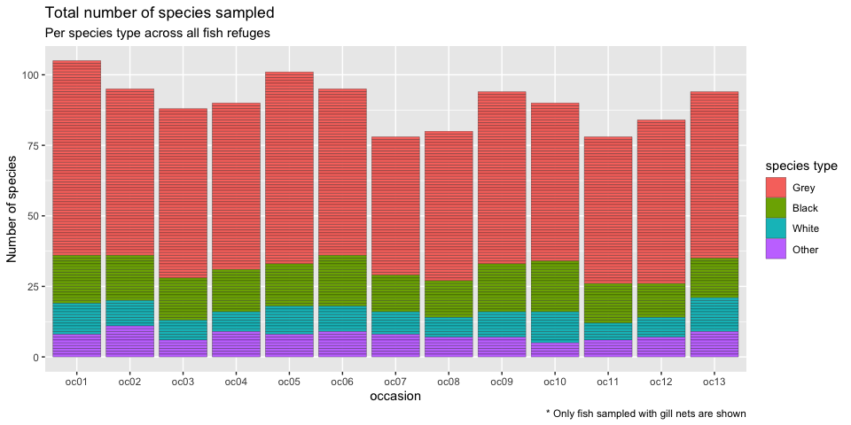
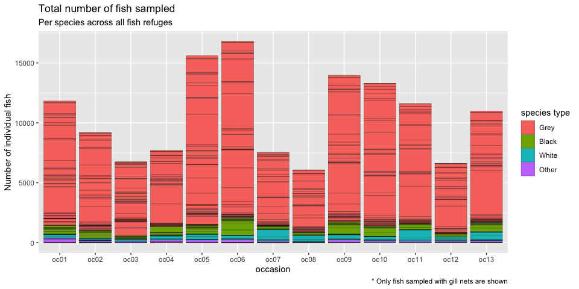
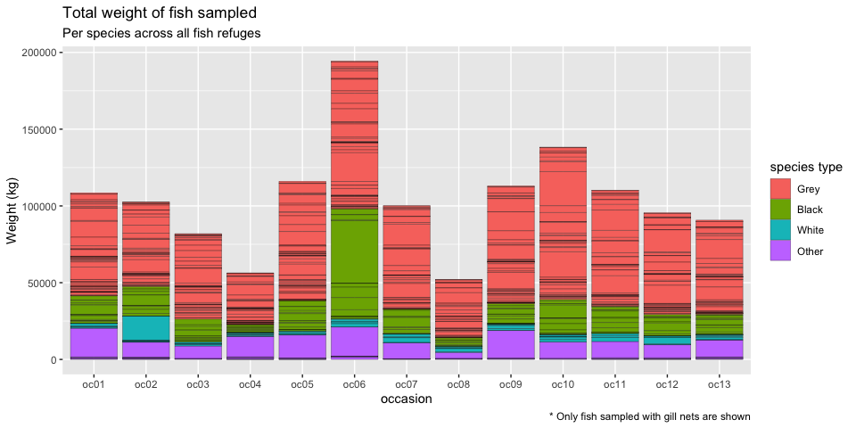

Catch composition
================

Before diving into targeted analysis we want to have a quick look at the
catch data, primarily in terns of species and sites.

First we load the data and calculate some summarising statistics.

``` r
drake::loadd(catch_info)
drake::loadd(species_info)
species_totals <- catch_info %>%
  dplyr::filter(gear == "GN") %>%
  dplyr::group_by(occasion, gear, species) %>%
  dplyr::summarise_if(is.numeric, sum, na.rm = TRUE) %>%
  dplyr::inner_join(species_info, by = "species") %>%
  dplyr::ungroup() %>%
  dplyr::mutate(species_type_simple = forcats::fct_reorder(species_type_simple, no_fish,.fun = sum, .desc = T), 
                species = forcats::fct_reorder(species, as.numeric(species_type_simple)))
```

Now we have a look at the catch composition using three different
metrics: the number of unique species caught, the number of individual
fish caught, and the total weight of the catch. We will later have a
more thorough look via the Index of Relative Importance.

In all the graphs below a box corresponds to an individual species and
the color corresponds to the species type.

``` r
species_totals %>%
  ggplot(aes(x  = occasion)) +
  geom_bar(aes(fill = species_type_simple, group = species), 
           colour = "black", size = 0.1, position = "stack") +
  labs(fill = "species type", 
       y = "Number of species", 
       title = "Total number of species sampled", 
       subtitle = "Per species type across all fish refuges", 
       caption = "* Only fish sampled with gill nets are shown")
```

<!-- -->

``` r
species_totals %>%
  ggplot(aes(x  = occasion, y = no_fish)) +
  geom_col(aes(fill = species_type_simple, group = species), 
           colour = "black", size = 0.1, position = "stack") +
  labs(fill = "species type", 
       y = "Number of individual fish", 
       title = "Total number of fish sampled", 
       subtitle = "Per species across all fish refuges", 
       caption = "* Only fish sampled with gill nets are shown")
```

<!-- -->

``` r
species_totals %>%
  ggplot(aes(x  = occasion, y = total_weight)) +
  geom_col(aes(fill = species_type_simple, group = species), 
           colour = "black", size = 0.1, position = "stack") +
  labs(fill = "species type", 
       y = "Weight (kg)", 
       title = "Total weight of fish sampled", 
       subtitle = "Per species across all fish refuges", 
       caption = "* Only fish sampled with gill nets are shown")
```

<!-- -->

From the graphs above we can learn that

  - Species richness and catch tends to be higher in the second sampling
    of the wet season and lower otherwise. This indicates that in
    further analysis, wet and dry season shouldn’t be grouped together
    but one must distinguish between each of the four samplings.
  - \-Grey’ species appear to be the most important group of species
    throughout the study, particularly in terms of abundance. ‘Black’
    and ‘Other’ species are overwhelmingly important in terms of biomass
    relative to their abundance.
