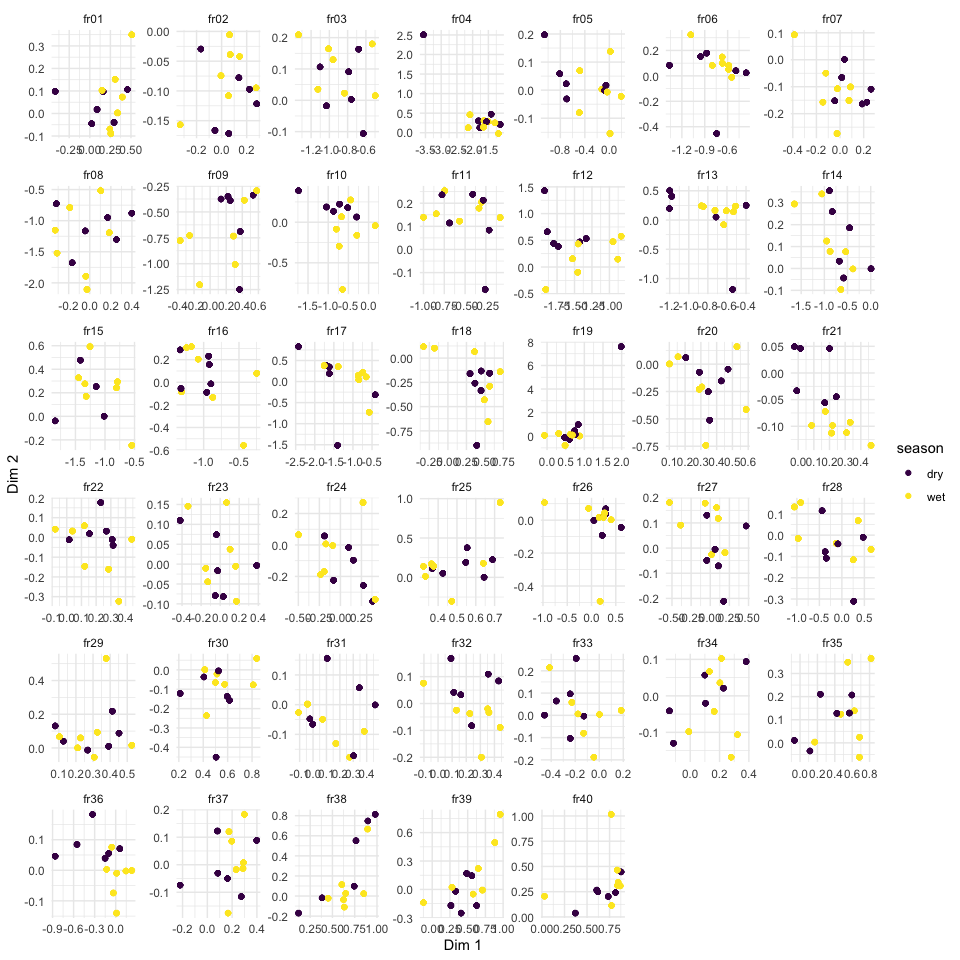

Correspondence analyis
================

``` r
drake::loadd(catch_info)
drake::loadd(refuge_info)
drake::loadd(occasion_info)
drake::loadd(species_info)
```

Just a quick look at the differences between samplings reveals, as
expected that the largest differences in catch are due to fishing gear.
The separation is evident.

``` r
occasion_cov <- occasion_info %>%
  mutate(year = lubridate::year(date),
         month = lubridate::month(date), 
         season = if_else(month %in% c(2,5), "dry", "wet")) %>%
  select(occasion, year, season, month) %>%
  distinct()

catch_standard <- catch_info %>%
 # standardise replicate sampling
  group_by(refuge, occasion, gear, species) %>%
  summarise(
    across(c(no_fish, total_weight), ~round(mean(., na.rm = T)* 8)), 
    .groups = "drop")

catch_wide <- catch_standard %>%
  # Convert to a matrix
  pivot_wider(id_cols = c("refuge", "occasion", "gear"), 
              names_from = "species", 
              values_from = "no_fish") %>%
  # fill un-sampled species to zero
  mutate(across(where(is_numeric), tidyr::replace_na, replace = 0),
         across(where(is.numeric), log1p)) %>%
  left_join(select(refuge_info, refuge, category), by = "refuge") %>%
  left_join(occasion_cov, by = "occasion") %>%
  select(!starts_with("sp"), starts_with("sp")) %>%
  mutate(across(1:7, factor)) 

catch_ca <- catch_wide %>%
  FactoMineR::CA(quali.sup = 1:7, graph = FALSE)

factoextra::fviz_ca_row(catch_ca, col.row = catch_wide$gear, axes = c(1,2), geom = c("point")) +
  scale_colour_viridis_d() 
```

<!-- -->

In order to prevent masking of other patterns due to gear, and because
of the sampling irregularities, we will repeat the visualisation, but
this time only looking at the gill net data.

A new pattern emerges, and now community seems to be best explained by
the fish refuge it belongs to. The signal appears to be fairly weak
though and is less evident when species numbers are not log-transformed.

``` r
catch_gn_wide <- catch_wide %>%
  filter(gear == "GN") %>%
  select(-gear)

catch_gn_ca <- catch_gn_wide %>%
  select(-(1:6)) %>%
  FactoMineR::CA(graph = FALSE)

factoextra::fviz_ca_row(catch_gn_ca, col.row = catch_gn_wide$refuge, axes = c(1,2), geom = c("point")) +
  scale_colour_viridis_d() 
```

<!-- -->

There doesn’t appear to be any evident similarities (at least in the
first two axis) among seasons within a refuge, or among refuge
categories within an occasion.

``` r
catch_gn_ca$row$coord %>%
  as.data.frame() %>%
  bind_cols(catch_gn_wide) %>%
  ggplot(aes(x = `Dim 1`, y = `Dim 2`, colour = season)) +
  geom_point() +
  facet_wrap("refuge", scales = "free") +
  scale_colour_viridis_d() +
  theme_minimal()
```

<!-- -->

``` r
catch_gn_ca$row$coord %>%
  as.data.frame() %>%
  bind_cols(catch_gn_wide) %>%
  ggplot(aes(x = `Dim 1`, y = `Dim 2`, colour = category)) +
  geom_point() +
  facet_wrap("occasion", scales = "free") +
  scale_colour_viridis_d() +
  theme_minimal()
```

<!-- -->

### By species groups

We will now group species by type to see if that simplifies things. But
no… There seems to be a bit of a thing with category 1 sites (Reservoir
for irrigation in upland area) which seem to have a higer proportion of
grey species than the other categories.

``` r
catch_type_gn_wide <- catch_gn_wide %>%
  pivot_longer(starts_with("sp"), names_to = "species", values_to = "n") %>%
  left_join(select(species_info, species, type), by = "species") %>%
  mutate(type = snakecase::to_snake_case(type), 
         type = fct_lump_n(type, 3)) %>%
  group_by(refuge, occasion, category, year, season, month, type) %>%
  summarise(n = I(sum(n)), .groups = "drop") %>%
  pivot_wider(names_from = "type", values_from = "n")

catch_type_gn_ca <- catch_type_gn_wide %>%
  select(-(1:6)) %>%
  FactoMineR::CA(graph = FALSE)
  
factoextra::fviz_ca_row(catch_type_gn_ca, geom = "point", habillage = catch_gn_wide$category, addEllipses = T) +
  scale_colour_viridis_d() 
```

<!-- -->

``` r
factoextra::fviz_ca_row(catch_type_gn_ca, geom = "point", habillage = catch_gn_wide$season, addEllipses = T) +
  scale_colour_viridis_d() 
```

<!-- -->

``` r
factoextra::fviz_ca_biplot(catch_type_gn_ca)
```

<!-- -->
