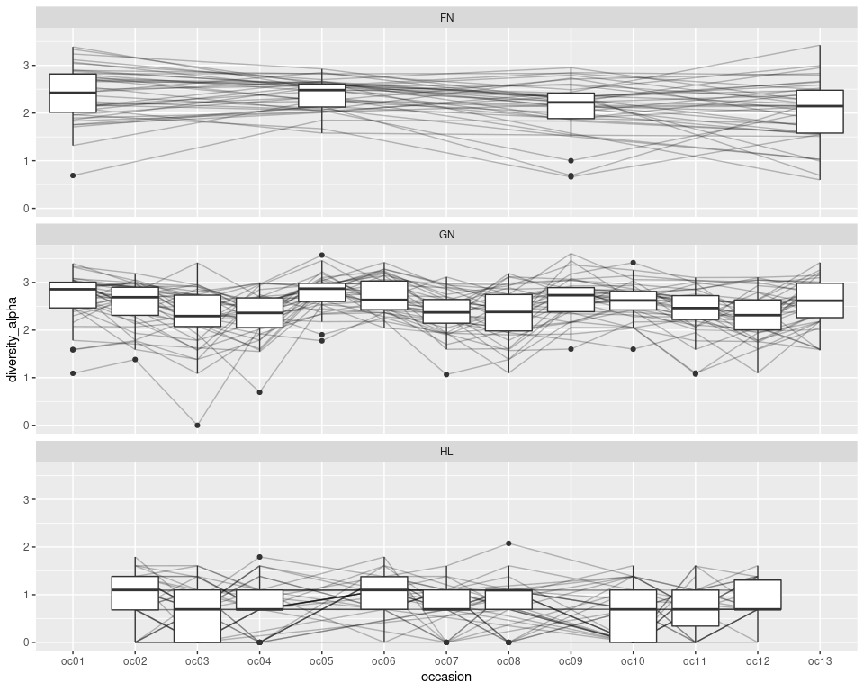

Alpha diversity
================

``` r
drake::loadd(catch_info)
```

``` r
catch_standard <- catch_info %>%
 # standardise replicate sampling
  group_by(refuge, occasion, gear, species) %>%
  summarise(
    across(c(no_fish, total_weight), ~round(mean(., na.rm = T)* 8)), 
    .groups = "drop")

catch_wide <- catch_standard %>%
  # Convert to a matrix
  pivot_wider(id_cols = c("refuge", "occasion", "gear"), 
              names_from = "species", 
              values_from = "no_fish") %>%
  # fill un-sampled species to zero
  mutate(across(where(is_numeric), tidyr::replace_na, replace = 0),
         across(where(is.numeric), log1p)) %>%
  select(!starts_with("sp"), starts_with("sp")) 

div <- catch_wide %>%
  select(starts_with("sp")) %>%
  as.matrix() %>% 
  vegan::diversity(index = "shannon", base = exp(1))

diversity <- catch_wide %>%
  select(!starts_with("sp")) %>%
  mutate(diversity_alpha = div) 

diversity %>%
  ggplot(aes(x = occasion, y = diversity_alpha)) +
  geom_line(aes(group = refuge), alpha = 0.25) +
  geom_boxplot() +
  facet_wrap("gear", ncol = 1)
```

<!-- -->
