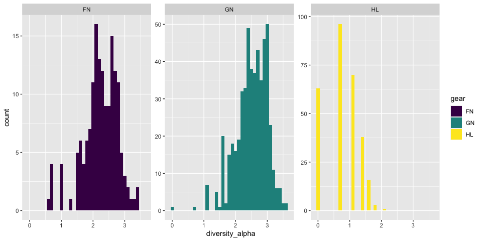
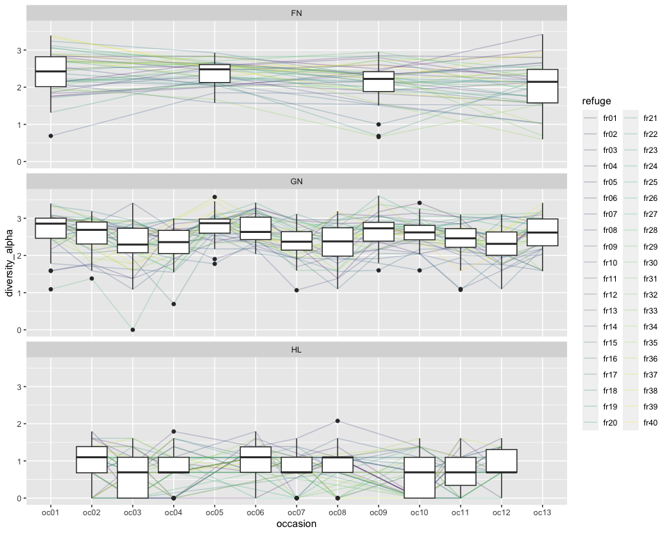
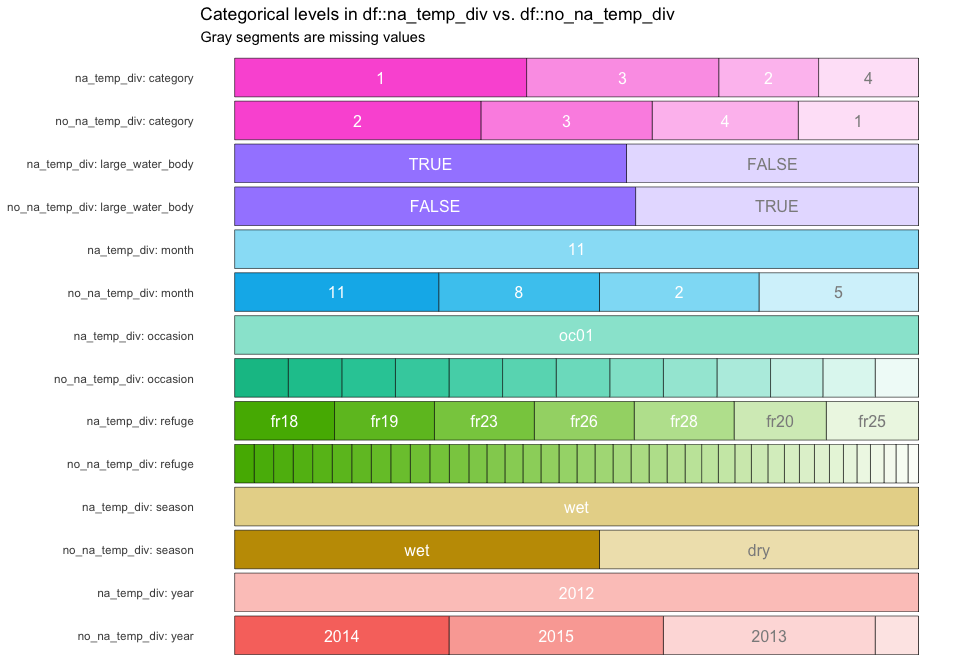
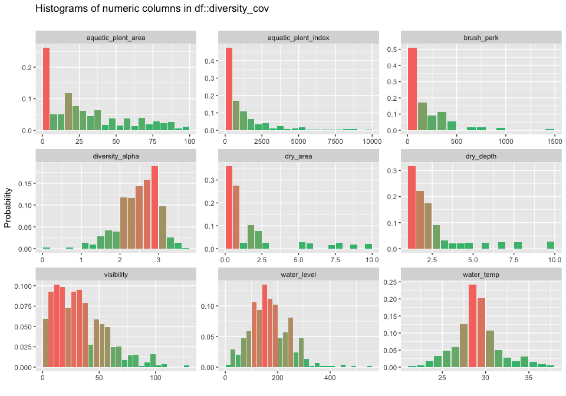
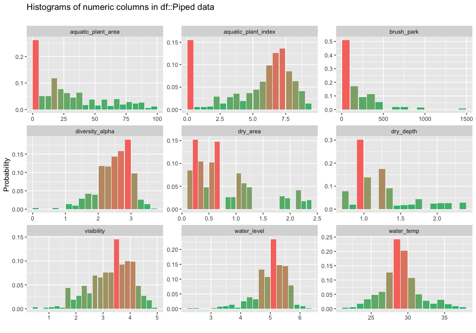
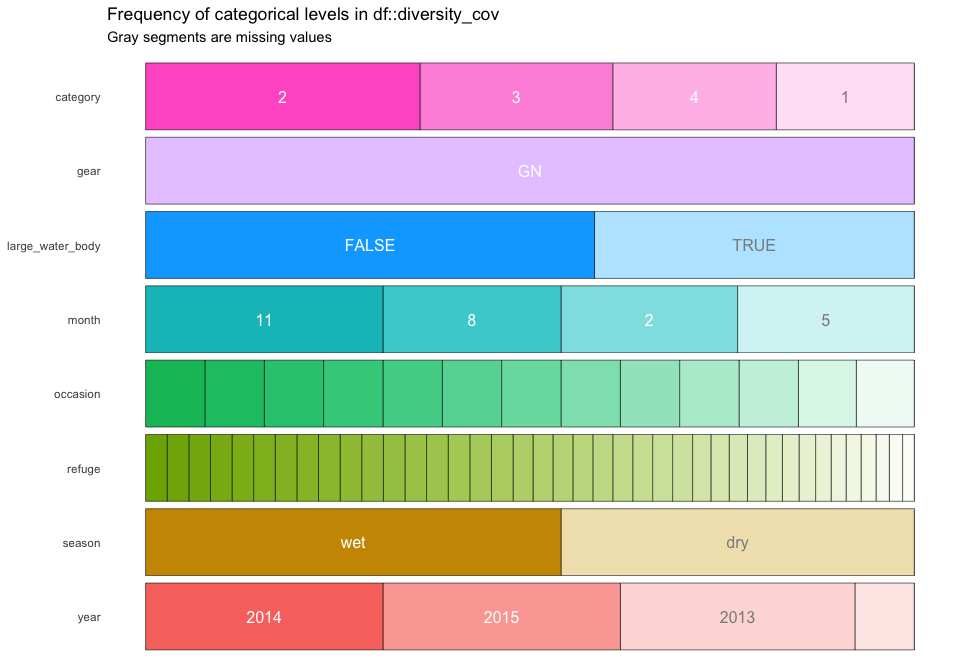
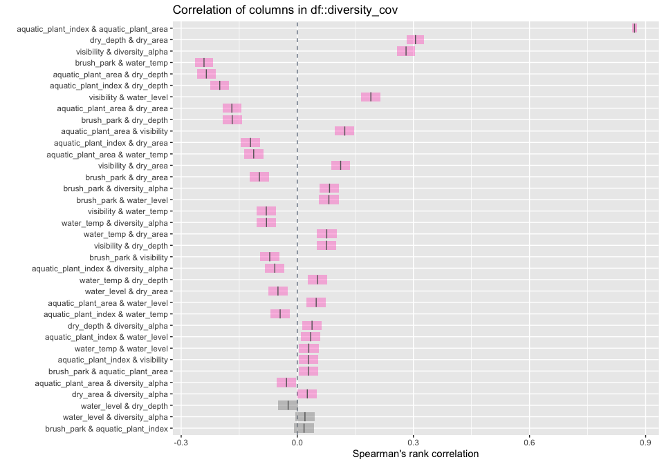
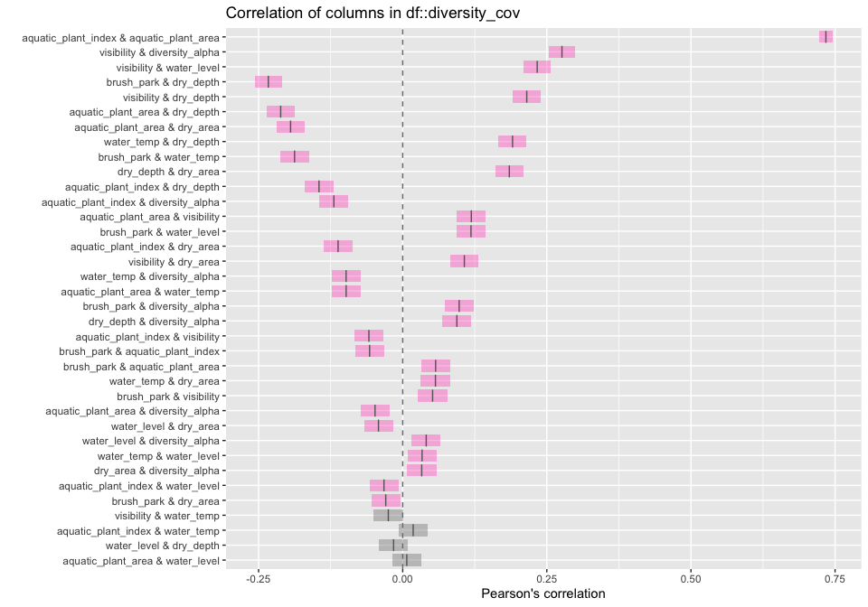
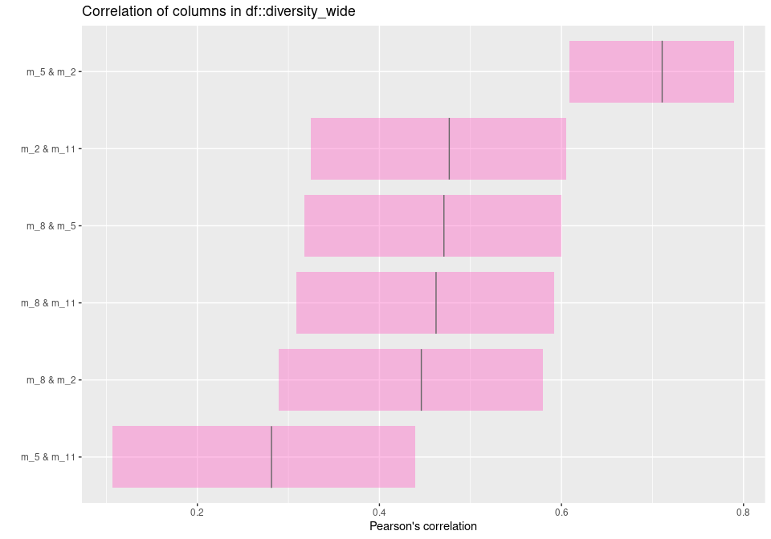

Alpha diversity
================

``` r
drake::loadd(catch_info)
drake::loadd(refuge_info)
drake::loadd(occasion_info)
```

Claculate shannon’s diversity index

``` r
catch_standard <- catch_info %>%
 # standardise replicate sampling
  group_by(refuge, occasion, gear, species) %>%
  summarise(
    # Mean not appropriate as some surveys came empty even when they were
    # performed. For analysis need to calculate number of samplings performed
    # and standardise using that rather than the mean
    across(c(no_fish, total_weight), ~round(mean(., na.rm = T)* 8)), 
    .groups = "drop")

catch_wide <- catch_standard %>%
  # Convert to a matrix
  pivot_wider(id_cols = c("refuge", "occasion", "gear"), 
              names_from = "species", 
              values_from = "no_fish") %>%
  # fill un-sampled species to zero
  mutate(across(where(is_numeric), tidyr::replace_na, replace = 0),
         across(where(is.numeric), log1p)) %>%
  select(!starts_with("sp"), starts_with("sp")) 

div <- catch_wide %>%
  select(starts_with("sp")) %>%
  as.matrix() %>% 
  vegan::diversity(index = "shannon", base = exp(1))

diversity <- catch_wide %>%
  select(!starts_with("sp")) %>%
  mutate(diversity_alpha = div) 
```

Having a look at the distribution we can see that the diversity of Line
fishing is lower than gill net and fike nets. Also it seems it looks
like need any special transformation for modelling; particularly if only
gill net diversity values are included.

``` r
diversity %>%
  ggplot(aes(x = diversity_alpha, fill = gear)) +
  geom_histogram(binwidth = 0.1, position = "stack", center = 0) +
  scale_fill_viridis_d() +
  facet_wrap("gear", scales = "free_y")
```

<!-- -->

It also appears, as it was seen in previous data explorations, that the
diversity at the end of the wet season seems to be the highest while the
diversity at the end of the dry season or beginning of the wet season
seems to be the lowest.

``` r
diversity %>%
  ggplot(aes(x = occasion, y = diversity_alpha)) +
  geom_line(aes(group = refuge, colour = refuge), alpha = 0.25) +
  geom_boxplot() +
  scale_color_viridis_d() +
  facet_wrap("gear", ncol = 1)
```

<!-- -->

## Covariates of diversity

We now integrate other data about sites and locations that can be useful
at explaining diversity values. This can be later used in a statistical
model.

``` r
occasion_cov <- occasion_info %>%
  mutate(year = lubridate::year(date),
         month = lubridate::month(date), 
         season = if_else(month %in% c(2,5), "dry", "wet"), 
         water_level = (gauge_start + gauge_finish) / 2, 
         visibility = secchi_depth, 
         aquatic_plant_index = aquatic_plant_area * aquatic_plant_density, 
         across(c("month", "year"), as.character)) %>%
  select(refuge, occasion, year, season, month, water_level, water_temp, visibility,
         aquatic_plant_area, aquatic_plant_index, brush_park) %>%
  distinct()

refuge_cov <- refuge_info %>%
  mutate(dry_area = area_dry_ha, 
         dry_depth = depth_dry_m, 
         rf_area_connected = log(rf_area_connected_in_wet_season_ha), 
         across(category, as.character)) %>%
  select(refuge, category, dry_area, dry_depth, large_water_body)

diversity_cov <- diversity %>%
  left_join(refuge_cov, by = "refuge") %>%
  left_join(occasion_cov, by = c("occasion", "refuge")) %>%
  filter(gear == "GN")
```

### Missing values

Water temperature and the aquatic\_plant measurements appear to have
small levels of missing values. We might need to check wheter there is a
systematic bias on missing values before including these two variables
in a model.

``` r
inspectdf::inspect_na(diversity_cov) %>% filter(pcnt > 0) %>% knitr::kable()
```

| col\_name             | cnt |      pcnt |
| :-------------------- | --: | --------: |
| water\_temp           |   7 | 1.3513514 |
| aquatic\_plant\_index |   1 | 0.1930502 |

It appears that all cases of missing water temperature are within the
first occasion at the end of the wet season in 2012.

``` r
na_temp_div <- filter(diversity_cov, is.na(water_temp)) %>% select(-water_temp, -gear)
no_na_temp_div <- filter(diversity_cov, !is.na(water_temp)) %>% select(-water_temp, -gear)
inspectdf::inspect_cat(na_temp_div, no_na_temp_div) %>% inspectdf::show_plot()
```

<!-- -->

### Variable distributions

Some variables might be better behaved with a log-transformation. These
include, the plant index, dry\_area, dry\_depth, and perhaps visibility
and water level.

``` r
inspectdf::inspect_num(diversity_cov) %>% inspectdf::show_plot()
```

<!-- -->

``` r
diversity_cov %>%
  mutate(across(c(aquatic_plant_index, dry_area, dry_depth, visibility, water_level), log1p)) %>%
  inspectdf::inspect_num() %>% inspectdf::show_plot()
```

<!-- -->

### Categotries balance

Categories appear to be well balanced except for 2012 year which would
be potentially confounded with occasion 01.

``` r
inspectdf::inspect_cat(diversity_cov) %>% inspectdf::show_plot()
```

<!-- -->

### Correlations

Larger refuges also tend to be deeper so maybe we can integrate these
two variables into one or just use one of them as an explanatory
variable.

Also there seems to be a positive relationship between visibility, water
level, aquatic plants and diversity. And a negative between those and
water temperature.

Dry depth and dry area appear to be non-seasonal factors that are
positively correlated with diversity.

These results generally agree with the multivariate analysis of
[seasonality](%22seasonality.md%22)

``` r
inspectdf::inspect_cor(diversity_cov, method = "spearman") %>% inspectdf::show_plot()
```

<!-- -->

When using a Pearson correlation coefficient, patterns hold except for
the aquatic plant index which reverses. This shows the importance of the
very large values in this index which are reduced when using the
spearman coefficient.

``` r
inspectdf::inspect_cor(diversity_cov, method = "pearson") %>% inspectdf::show_plot()
```

<!-- -->

### Statistical model

A quick exploration of the diversity parameters.

First, we are interested on investigating whether there are diversity
differences across seasons, and particularly the beginning and the end
of each of them. First, we use a extra simple model with seasons/months
as categorical values which is looking for significant differences among
them. Then, we look at a more mechanistic point of view which looks at
the environmental factors that promote diversity.

``` r
m_c <- lm(diversity_alpha ~ month + year, data = diversity_cov)
summary(m_c)
```

    ## 
    ## Call:
    ## lm(formula = diversity_alpha ~ month + year, data = diversity_cov)
    ## 
    ## Residuals:
    ##      Min       1Q   Median       3Q      Max 
    ## -2.33628 -0.26363  0.05577  0.32932  1.07517 
    ## 
    ## Coefficients:
    ##             Estimate Std. Error t value Pr(>|t|)    
    ## (Intercept)  2.67534    0.07409  36.107  < 2e-16 ***
    ## month2      -0.04734    0.06063  -0.781    0.435    
    ## month5      -0.32535    0.06063  -5.367 1.22e-07 ***
    ## month8      -0.35442    0.06050  -5.858 8.38e-09 ***
    ## year2013    -0.01370    0.09079  -0.151    0.880    
    ## year2014     0.02037    0.09076   0.224    0.823    
    ## year2015    -0.01332    0.09076  -0.147    0.883    
    ## ---
    ## Signif. codes:  0 '***' 0.001 '**' 0.01 '*' 0.05 '.' 0.1 ' ' 1
    ## 
    ## Residual standard error: 0.4686 on 511 degrees of freedom
    ## Multiple R-squared:  0.1075, Adjusted R-squared:  0.09702 
    ## F-statistic: 10.26 on 6 and 511 DF,  p-value: 9.781e-11

``` r
m_m <- lm(diversity_alpha ~ water_level + aquatic_plant_area + brush_park + water_temp, 
           data = diversity_cov)
summary(m_m)
```

    ## 
    ## Call:
    ## lm(formula = diversity_alpha ~ water_level + aquatic_plant_area + 
    ##     brush_park + water_temp, data = diversity_cov)
    ## 
    ## Residuals:
    ##      Min       1Q   Median       3Q      Max 
    ## -2.48739 -0.30476  0.04681  0.36366  1.10807 
    ## 
    ## Coefficients:
    ##                      Estimate Std. Error t value Pr(>|t|)    
    ## (Intercept)         2.958e+00  2.569e-01  11.517   <2e-16 ***
    ## water_level         1.388e-04  2.893e-04   0.480   0.6316    
    ## aquatic_plant_area -9.713e-04  7.941e-04  -1.223   0.2218    
    ## brush_park          1.696e-04  9.406e-05   1.803   0.0719 .  
    ## water_temp         -1.639e-02  8.415e-03  -1.947   0.0521 .  
    ## ---
    ## Signif. codes:  0 '***' 0.001 '**' 0.01 '*' 0.05 '.' 0.1 ' ' 1
    ## 
    ## Residual standard error: 0.4864 on 506 degrees of freedom
    ##   (7 observations deleted due to missingness)
    ## Multiple R-squared:  0.01968,    Adjusted R-squared:  0.01193 
    ## F-statistic:  2.54 on 4 and 506 DF,  p-value: 0.03914

We found that the average difference between the beginning and end of
the seasons is fairly small and that the differences among years is also
relatively small.

The model with mechanistic variables show some significant relationships
but the R2 of that model is really small. Suggesting that they are not
as important on its own and account for only a small amount of
variability that can be explained by treating seasonality as a
categorical variable.

If we use models like this in the actual paper we should focus on the
categorical model and explain how environmental co-variates change
across seasons.

``` r
diversity_wide <- diversity_cov %>%
  mutate(year_s = (as.numeric(substr(occasion, 3, 4))-1) %/% 4, 
         month_s = paste0("m_", month)) %>% 
  pivot_wider(id_cols = c(refuge, year), 
              names_from = month_s, 
              values_from = diversity_alpha) 

diversity_wide %>%
  inspectdf::inspect_cor() %>%
  inspectdf::show_plot()
```

<!-- -->

``` r
m_dw <- lm(m_8 ~ m_5, data = diversity_wide)
m_dw2 <- lm(m_11 ~ m_5, data = diversity_wide)
summary(m_dw)
```

    ## 
    ## Call:
    ## lm(formula = m_8 ~ m_5, data = diversity_wide)
    ## 
    ## Residuals:
    ##      Min       1Q   Median       3Q      Max 
    ## -1.43869 -0.24339 -0.01305  0.28706  0.89531 
    ## 
    ## Coefficients:
    ##             Estimate Std. Error t value Pr(>|t|)    
    ## (Intercept)  1.27716    0.18584   6.873 3.26e-10 ***
    ## m_5          0.44637    0.07731   5.773 6.50e-08 ***
    ## ---
    ## Signif. codes:  0 '***' 0.001 '**' 0.01 '*' 0.05 '.' 0.1 ' ' 1
    ## 
    ## Residual standard error: 0.4342 on 117 degrees of freedom
    ##   (41 observations deleted due to missingness)
    ## Multiple R-squared:  0.2217, Adjusted R-squared:  0.2151 
    ## F-statistic: 33.33 on 1 and 117 DF,  p-value: 6.505e-08

``` r
summary(m_dw2)
```

    ## 
    ## Call:
    ## lm(formula = m_11 ~ m_5, data = diversity_wide)
    ## 
    ## Residuals:
    ##     Min      1Q  Median      3Q     Max 
    ## -1.1206 -0.2550  0.0656  0.2547  0.9204 
    ## 
    ## Coefficients:
    ##             Estimate Std. Error t value Pr(>|t|)    
    ## (Intercept)  2.10955    0.18198  11.592  < 2e-16 ***
    ## m_5          0.24022    0.07571   3.173  0.00193 ** 
    ## ---
    ## Signif. codes:  0 '***' 0.001 '**' 0.01 '*' 0.05 '.' 0.1 ' ' 1
    ## 
    ## Residual standard error: 0.4252 on 117 degrees of freedom
    ##   (41 observations deleted due to missingness)
    ## Multiple R-squared:  0.07923,    Adjusted R-squared:  0.07136 
    ## F-statistic: 10.07 on 1 and 117 DF,  p-value: 0.001928
