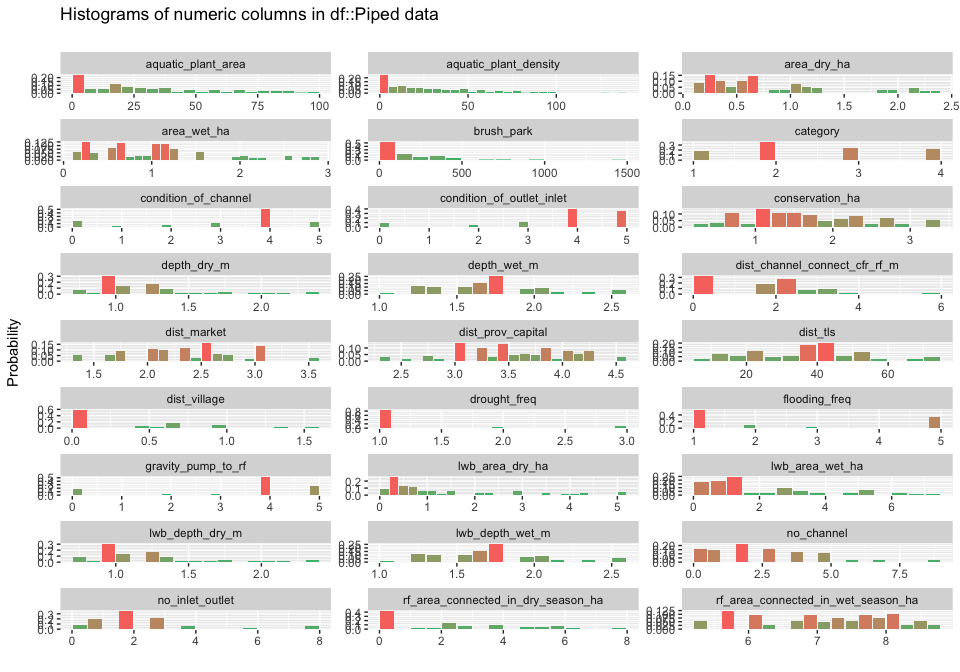
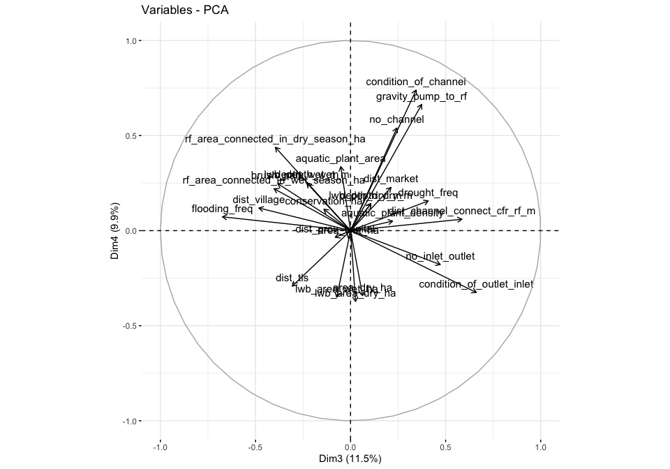
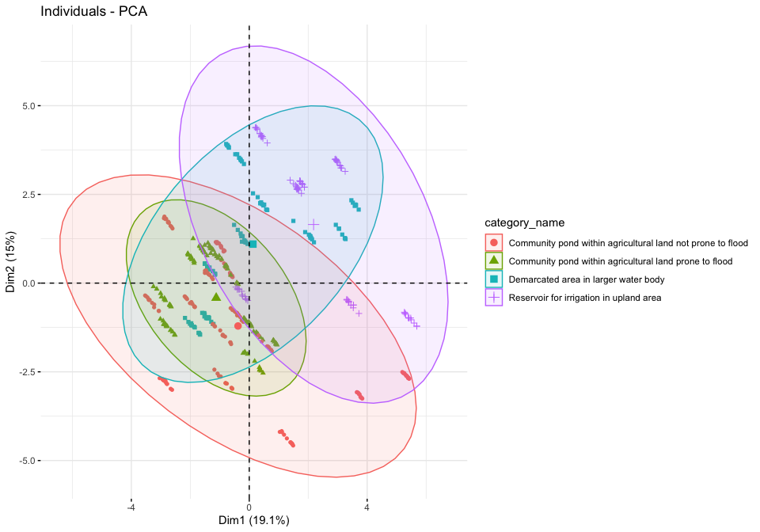

Site exploration
================

``` r
drake::loadd(refuge_info)
```

``` r
inspectdf::inspect_cat(refuge_info) %>% inspectdf::show_plot()
```

<!-- -->

``` r
inspectdf::inspect_num(refuge_info) %>% inspectdf::show_plot()
```

<!-- -->

``` r
inspectdf::inspect_cor(refuge_info, method = "spearman") %>% 
  filter(p_value < 0.1) %>%
  inspectdf::show_plot()
```

<!-- -->

``` r
refuge_log <- refuge_info %>%
  mutate(across(c(area_dry_ha, area_wet_ha, conservation_ha, depth_dry_m, depth_wet_m, dist_channel_connect_cfr_rf_m, dist_market, dist_prov_capital, dist_village, lwb_area_dry_ha, lwb_area_wet_ha, lwb_depth_dry_m, lwb_depth_wet_m, rf_area_connected_in_dry_season_ha, rf_area_connected_in_wet_season_ha), log1p)) 

refuge_log %>%
  inspectdf::inspect_num() %>%
  inspectdf::show_plot()
```

<!-- -->

``` r
refuge_pca <- refuge_log %>%
  select(category_name, large_water_body, channel_type, shape, type_inlet_outlet, where(is.numeric), -category) %>% 
  # mutate(across(c(illegal_fishing, water_bird, other_animal), as.numeric)) %>%
  FactoMineR::PCA(quali.sup = 1:5, graph = F)

# FactoInvestigate::Investigate(refuge_pca)

factoextra::fviz_pca_var(refuge_pca)
```

<!-- -->

``` r
factoextra::fviz_pca_var(refuge_pca, axes = 3:4)
```

<!-- -->

``` r
factoextra::fviz_pca_ind(refuge_pca, geom = "point", habillage = "large_water_body", addEllipses = T)
```

<!-- -->

``` r
factoextra::fviz_pca_ind(refuge_pca, geom = "point", habillage = "category_name", addEllipses = T)
```

<!-- -->

``` r
factoextra::fviz_pca_ind(refuge_pca, geom = "point", habillage = "channel_type", addEllipses = T, axes = 3:4)
```

    ## Too few points to calculate an ellipse

<!-- -->

``` r
factoextra::fviz_pca_ind(refuge_pca, geom = "point", habillage = "type_inlet_outlet", addEllipses = T, axes = 3:4)
```

    ## Too few points to calculate an ellipse

<!-- -->

``` r
factoextra::fviz_pca_ind(refuge_pca, geom = "point", habillage = "category_name", addEllipses = T, axes = 3:4)
```

<!-- -->

Looks like lwb\_depth\_dry\_m and lwb\_area\_wet\_ha are almost
orthogonal and are highly correlated with axis 1 and 2. For axis 3 and 4
looks like we can use some more: no\_channel,
rf\_area\_connected\_in\_dry\_season\_ha. We’ll probably add
dist\_village and dist\_market because they are interesting. The only
categorical variable that seems to be strongly correlated with these
categorical ones is channel\_type.
