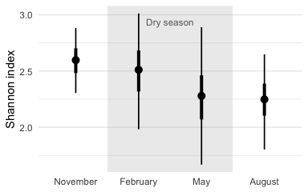
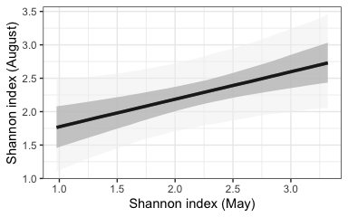
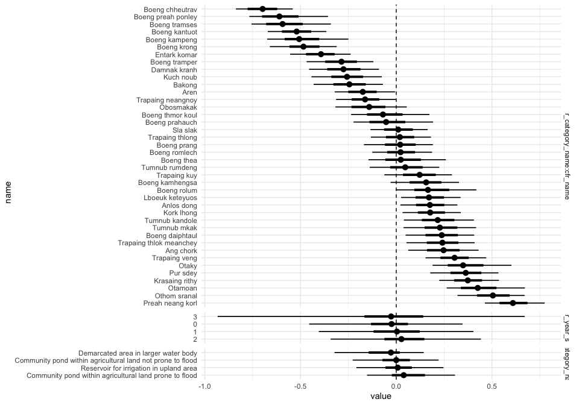
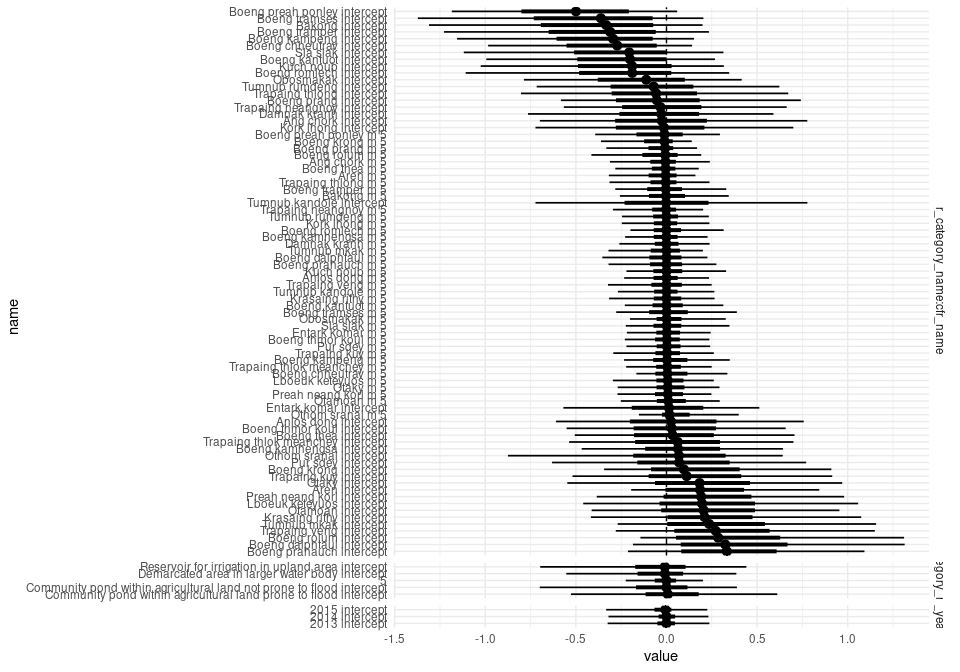

Preliminary analysis
================

## Summary

  - Diversity changes over the year. Diversity is the highest at the end
    of the wet season and the lowest at the beginning of the wet season.
    Surprisingly,

## Question 1

Does aquatic food diversity changes throughout the year? We hypothesise
diversity is the lowest in May, at the end of the dry season, and the
highest on November, at the end of the wet season, when fields are
usually flooded and there is potential for species from multiple dry
season refuges in the landscape to mix.

### Methods

  - Selected only surveys performed with gill net which were performed
    across all seasons
  - Added number of individuals across replicates within a sampling
    occasion together
  - Calculated the Shannon diversity index of (log) species abundance
    for each refuge and occasion
  - Used a Bayesian test to compare diversity across the year. We
    included year and the refuge identity nested inside refuge type as
    random effects. For year we calculated a random intercept and also
    allowed month estimates to vary across years. To account for uneven
    sampling in smaller sites we included the (log) number of replicates
    in each sampling occasion an offset.
  - Tested the hypotheses comparing diversity across the year and across
    different refuge category types.

### Results

  - The R<sup>2</sup> of our model was between 0.49 and 0.57 (95%
    probability) which indicates that the model was able to account for
    a substantial proportion of the variation in alpha diversity.
  - We found that the alpha diversity in November, at the end of the wet
    season was very likely higher than the diversity in August (at the
    beginning of the wet season; *p* = 0.02). Diversity in November was
    also likely to be higher than the diversity during the dry season
    but the difference was not significant at the *α* = 0.05 level (*p*
    = 0.20 for February and *p* = 0.06 for May).
  - Similarly, we found that alpha diversity in May was likely to be
    smaller than the diversity in February but the difference was not
    significant at the 0.05 level (*p* = 0.11).

<!-- -->

*Figure 1: Distribution of the mean alpha-diversity over the year.
February and March are predominantly in the dry season. Dots indicate
the median of the distribution and lines indicate the 66 and 95%
credible intervals. Shannon diversity values have been standardised for
eight replicates for each sampling occasion.*

  - When looking at the random effects, we found that the variability in
    alpha diversity across refuges was very likely (with a 95%
    probability) to be between 2 and 7 times larger than the variability
    across year and between 2 and 7 times larger than the variability
    across refuge categories.
  - The data does not suggest that there are important differences among
    refuge classes. Nevertheless there is substantial evidence (82%
    likelihood) that mean diversity in refuges that consist in a
    demarcated area in a larger water body with perennial fishing is
    slightly smaller than diversity in community ponds within
    agricultural land prone to flood.

## Question 2

Does the diversity at the end of the dry season actually influences the
diversity in the wet season?

### Methods

  - Used a Bayesian regression to test whether the Shannon diversity
    index at the end of the dry season (May) is related to the diversity
    at the beginning of the wet season (August). As in the previous
    model, we included year and the refuge identity nested inside refuge
    type as random effects. For year we calculated a random intercept
    and for refuge and refuge-category we calculated random slopes and
    intercept. To account for uneven sampling in smaller sites we
    included the (log) number of replicates in each sampling occasion an
    offset.
  - Used data from 2013, 2014, and 2015 for which we had samples both
    during the dry and the wet season and removed occasions in which the
    refuge was completely dry and therefore the Shannon diversity index
    in May was zero.

### Results

  - The R<sup>2</sup> of the model was between 0.42 and 0.64 (95%
    probability) which indicates that the model was able to account for
    a substantial proportion of the variation in alpha diversity.
  - We found that there is almost certain that there is a positive
    association between the Shannon diversity index in May, at the end
    of the dry season, and the index in August, at the beginning of the
    wet season (*p* = 0.009).
  - This relationship between May’s and August’s diversity was
    maintained across years, refuge types, and even individual refuges
    (Supp. Figure 2).

<!-- -->

*Figure 2: Predicted mean relationship between Shannon diversity index
in May and August. Shaded areas indicate the 66 and 95% credible
intervals. Shannon diversity values have been standardised for eighr
replicates in each sampling occasion.*

## Question 3

Which environmental factors drive the changes in community composition
and potential decrease in species abundance/richness between start and
end of dry season?

## Supplementary figures

``` r
ref_data <- model_alpha_diversity %>%
  posterior_samples() %>%
  as.data.frame() %>%
  sample_frac(0.1) %>%
  select(starts_with("r_")) %>%
  pivot_longer(everything()) %>%
  mutate(random_effect = stringr::str_extract(name, ".+(?=\\[)"),
         name = str_extract(name, "(?<=\\[).+(?=,)"),
         name = if_else(str_detect(name, "_"),
                        str_extract(name, "(?<=_).+"),
                        name),
         name = snakecase::to_sentence_case(name)) %>%
  mutate(name = fct_reorder(name, value, .desc = T), 
         random_effect = fct_reorder(random_effect, value, 
                                     function(x){median(abs(x))}, 
                                     .desc = T))

ref_data %>%
  ggplot(aes(y = name, x = value)) +
  geom_vline(xintercept = 0, linetype = 2) +
  stat_pointinterval() +
  facet_grid(random_effect ~ ., scales = "free", space = "free") +
  theme_minimal()
```

<!-- -->

``` r
ref_data <- model_dry_wet %>%
  posterior_samples() %>%
  as.data.frame() %>%
  sample_frac(0.1) %>%
  select(starts_with("r_")) %>%
  pivot_longer(everything()) %>%
  mutate(random_effect = stringr::str_extract(name, ".+(?=\\[)"),
         name = str_extract(name, "(?<=\\[).+(?=\\])"),
         name = if_else(str_detect(name, "_"),
                        str_extract(name, "(?<=_).+"),
                        name),
         name = snakecase::to_sentence_case(name)) %>%
  mutate(name = fct_reorder(name, value, .desc = T), 
         random_effect = fct_reorder(random_effect, value, 
                                     function(x){median(abs(x))}, 
                                     .desc = T))

ref_data %>%
  ggplot(aes(y = name, x = value)) +
  geom_vline(xintercept = 0, linetype = 2) +
  stat_pointinterval() +
  facet_grid(random_effect ~ ., scales = "free", space = "free") +
  theme_minimal()
```

<!-- -->
