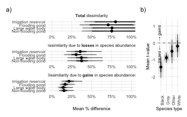
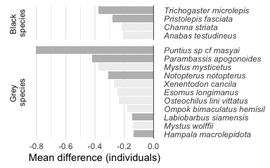

Preliminary analysis
================

## Question 1

Does aquatic food diversity changes throughout the year? We hypothesise
diversity is the lowest in May, at the end of the dry season, and the
highest on November, at the end of the wet season, when fields are
usually flooded and there is potential for species from multiple dry
season refuges in the landscape to mix.

### Methods

  - Selected only surveys performed with gill net which were performed
    across all seasons
  - Added number of individuals across replicates within a sampling
    occasion together
  - Calculated the Shannon diversity index of (log) species abundance
    for each refuge and occasion
  - Used a Bayesian test to compare diversity across the year. We
    included year and the refuge identity nested inside refuge type as
    random effects. For year we calculated a random intercept and also
    allowed month estimates to vary across years. To account for uneven
    sampling in smaller sites we included the (log) number of replicates
    in each sampling occasion an offset.
  - Tested the hypotheses comparing diversity across the year and across
    different refuge category types.

### Results

  - The R<sup>2</sup> of our model was between 0.49 and 0.57 (95%
    probability) which indicates that the model was able to account for
    a substantial proportion of the variation in alpha diversity.
  - We found that the alpha diversity in November, at the end of the wet
    season was very likely higher than the diversity in August (at the
    beginning of the wet season; *p* = 0.02). Diversity in November was
    also likely to be higher than the diversity during the dry season
    but the difference was not significant at the *α* = 0.05 level (*p*
    = 0.20 for February and *p* = 0.06 for May).
  - Similarly, we found that alpha diversity in May was likely to be
    smaller than the diversity in February but the difference was not
    significant at the 0.05 level (*p* = 0.11).

<!-- -->

*Figure 1: Distribution of the mean alpha-diversity over the year.
February and March are predominantly in the dry season. Dots indicate
the median of the distribution and lines indicate the 66 and 95%
credible intervals. Shannon diversity values have been standardised for
eight replicates for each sampling occasion.*

  - When looking at the random effects, we found that the variability in
    alpha diversity across refuges was very likely (with a 95%
    probability) to be between 2 and 7 times larger than the variability
    across year and between 2 and 7 times larger than the variability
    across refuge categories.
  - The data does not suggest that there are important differences among
    refuge classes. Nevertheless there is substantial evidence (82%
    likelihood) that mean diversity in refuges that consist in a
    demarcated area in a larger water body with perennial fishing is
    slightly smaller than diversity in community ponds within
    agricultural land prone to flood.

## Question 2

Does the diversity at the end of the dry season actually influences the
diversity in the wet season?

### Methods

  - Calculated the Shannon diversity index of (log) species abundance
    for each refuge and occasion as above.
  - Used a Bayesian regression to test whether the Shannon diversity
    index at the end of the dry season (May) is related to the diversity
    at the beginning of the wet season (August). As in the previous
    model, we included year and the refuge identity nested inside refuge
    type as random effects. For year we calculated a random intercept
    and for refuge and refuge-category we calculated random slopes and
    intercept. To account for uneven sampling in smaller sites we
    included the (log) number of replicates in each sampling occasion an
    offset.
  - Used data from 2013, 2014, and 2015 for which we had samples both
    during the dry and the wet season and removed occasions in which the
    refuge was completely dry and therefore the Shannon diversity index
    in May was zero.

### Results

  - The R<sup>2</sup> of the model was between 0.42 and 0.64 (95%
    probability) which indicates that the model was able to account for
    a substantial proportion of the variation in alpha diversity.
  - We found that there is almost certain that there is a positive
    association between the Shannon diversity index in May, at the end
    of the dry season, and the index in August, at the beginning of the
    wet season (*p* = 0.009).
  - This relationship between May’s and August’s diversity was
    maintained across years, refuge types, and even individual refuges
    (Supp. Figure 2).

<!-- -->

*Figure 2: Predicted mean relationship between Shannon diversity index
in May and August. Shaded areas indicate the 66 and 95% credible
intervals. Shannon diversity values have been standardised for eight
replicates in each sampling occasion.*

## Question 3

How does community composition changes within the dry season? Are there
factors that explain the differences?

### Methods

  - Added number of individuals for each species across replicates
    within a sampling occasion together.
  - Standardised the number of individuals counted in order to directly
    compare sites with differing number of replicates.
  - Calculated temporal beta-diversity index (TBI) between the
    sites-species matrix in February and May for each of the three years
    when sampling occurred.
  - We calculated two TBI versions one that account for presence/absence
    of species and another that also account for species abundance.
  - Used a Bayesian test to compare the mean TBI for these two versions.
    Specifically we used a multivariate framework in which the response
    variables were the dissimilarities due to gains and those due to
    losses. We calculated a random intercept for year and random
    intercepts for refuge and refuge type. Differences were modelled
    using a Beta distribution.
  - Performed multiple paired t-tests for the differences in abundances
    observed in February and May. We discarded species that do not
    differ in the date prior to calculation. Used 9999 permutations to
    calculate the p-values. We corrected permutation p-values for
    multiple testing using the Holm method.

### Results

  - Even though the diversity of the communities in February and March
    is not significantly different (Question 2) the *composition* of the
    communities in these months appears to be quite distinct. When using
    abundance data, the mean community dissimilarity (measured as
    percentage difference), which ranges between 0 (for two identical
    communities) and 1 (for completely different communities), was 0.64
    (0.4-0.98; 95% credible intervals).
  - These dissimilarities were primarily driven by losses rather than
    gains (*p* = 0.03). In fact, losses account for 72% (48%-84%) of the
    total dissimilarity.
  - We found that the dissimilarities are larger when using abundance
    data were higher than when using occurrence data (*p* = \<1e-04).
    Nevertheless, the dissimilarity when using occurrence data was still
    substantial at 0.51 (0.31, 0.85). This indicates, that changes are
    not only driven by a reduction in species abundances, but also by a
    reduction in the species present in May compared to February.

<!-- -->

*Figure 3: Changes in community composition in February, at the start of
the dry season, and May, towards the end of the dry season. Changes are
measured using the Temporal beta-diversity index which is composed by
dissimilarities due to species gains and species losses.*

  - We found that only a handful species show consistent changes between
    February and May across refuges and years. This is likely due to the
    dramatic differences in community composition across refuges and
    over time.

<!-- -->

*Figure 4: Species that showed a consistent decrease between February
and May across all refuges and years. Only species that show a likely
decrease (p \< 0.33) are shown. Species in which the decrease was
significant at the 0.05 level are shown in a darker shade.*

<!-- -->

  - On the factors that explain the dissimiarlities in community
    composition we found

## Supplementary figures

``` r
ref_data <- model_alpha_diversity %>%
  posterior_samples() %>%
  as.data.frame() %>%
  sample_frac(0.1) %>%
  select(starts_with("r_")) %>%
  pivot_longer(everything()) %>%
  mutate(random_effect = stringr::str_extract(name, ".+(?=\\[)"),
         name = str_extract(name, "(?<=\\[).+(?=,)"),
         name = if_else(str_detect(name, "_"),
                        str_extract(name, "(?<=_).+"),
                        name),
         name = snakecase::to_sentence_case(name)) %>%
  mutate(name = fct_reorder(name, value, .desc = T), 
         random_effect = fct_reorder(random_effect, value, 
                                     function(x){median(abs(x))}, 
                                     .desc = T))

ref_data %>%
  ggplot(aes(y = name, x = value)) +
  geom_vline(xintercept = 0, linetype = 2) +
  stat_pointinterval() +
  facet_grid(random_effect ~ ., scales = "free", space = "free") +
  theme_minimal()
```

<!-- -->

``` r
ref_data <- model_dry_wet %>%
  posterior_samples() %>%
  as.data.frame() %>%
  sample_frac(0.1) %>%
  select(starts_with("r_")) %>%
  pivot_longer(everything()) %>%
  mutate(random_effect = stringr::str_extract(name, ".+(?=\\[)"),
         name = str_extract(name, "(?<=\\[).+(?=\\])"),
         name = if_else(str_detect(name, "_"),
                        str_extract(name, "(?<=_).+"),
                        name),
         name = snakecase::to_sentence_case(name)) %>%
  mutate(name = fct_reorder(name, value, .desc = T), 
         random_effect = fct_reorder(random_effect, value, 
                                     function(x){median(abs(x))}, 
                                     .desc = T))

ref_data %>%
  ggplot(aes(y = name, x = value)) +
  geom_vline(xintercept = 0, linetype = 2) +
  stat_pointinterval() +
  facet_grid(random_effect ~ ., scales = "free", space = "free") +
  theme_minimal()
```

<!-- -->
