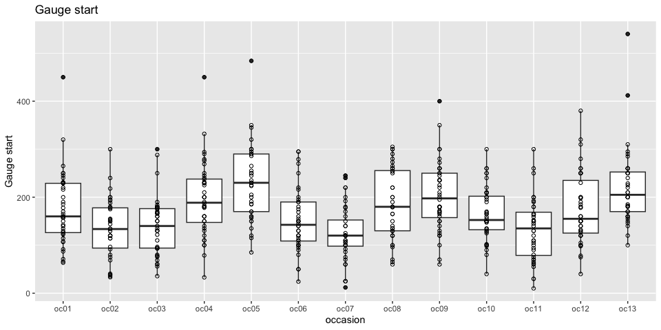
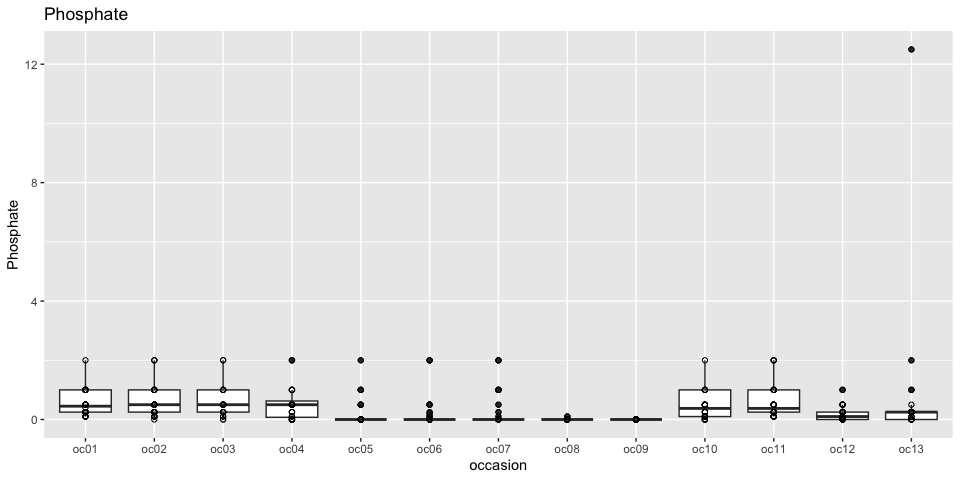
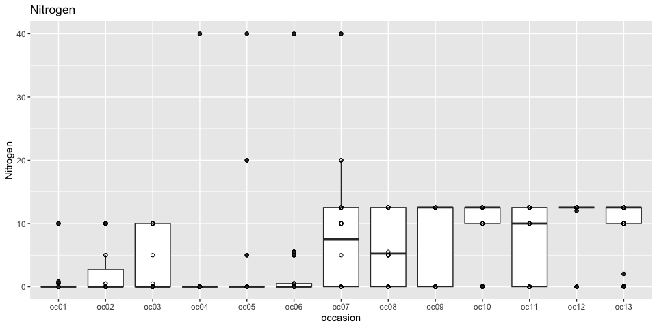
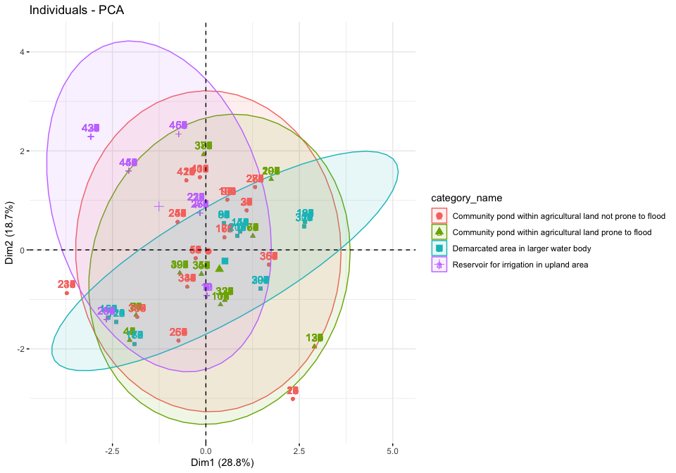
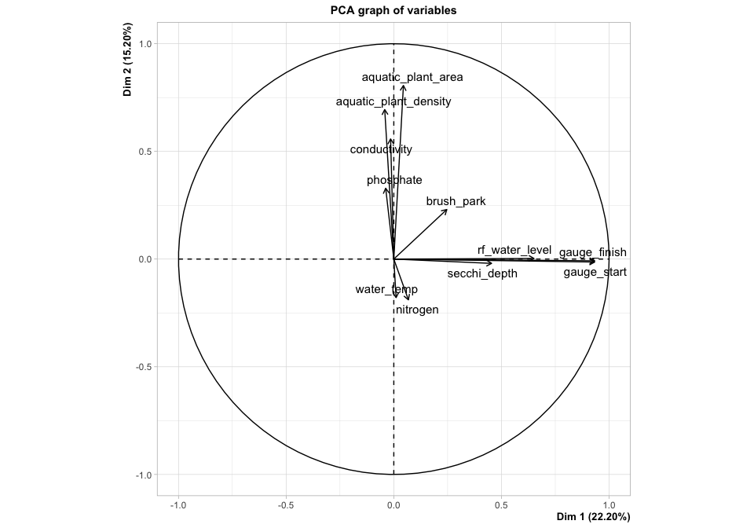
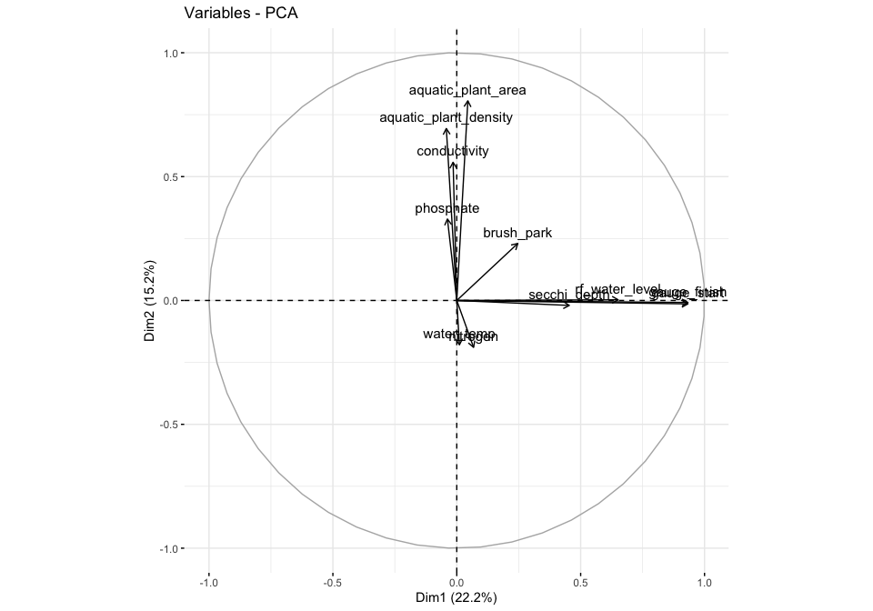
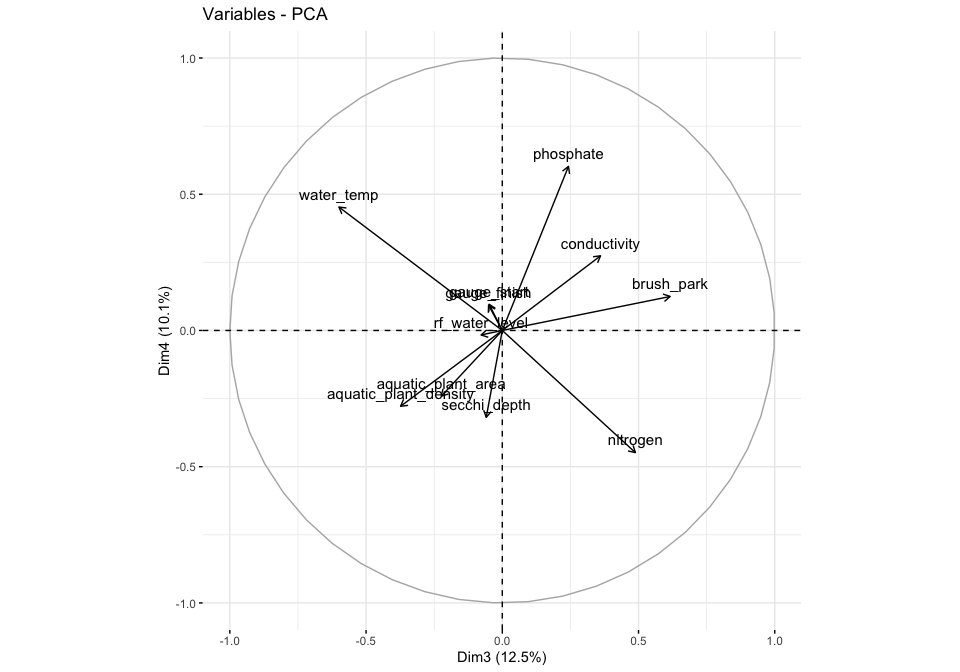
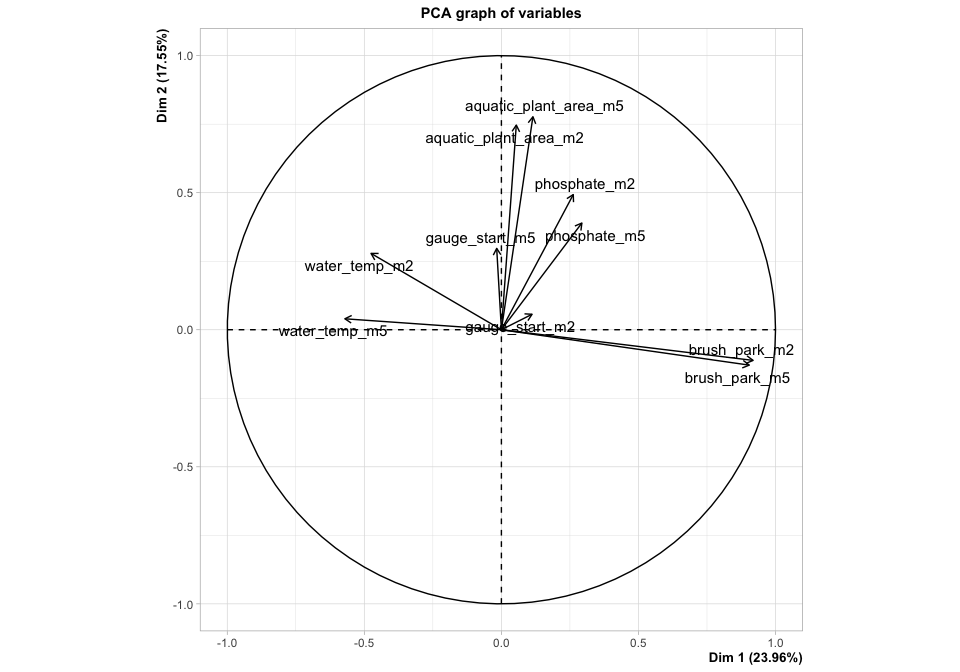

Seasonality
================

Here we explore the seasonality of the sampling.

``` r
drake::loadd(occasion_info)
drake::loadd(refuge_info)
```

``` r
# Function to plot a numeric variable
boxplot_occasion <- function(var){
  occasion_info %>%
    dplyr::select(-sampling) %>%
    dplyr::distinct() %>%
    ggplot(aes_string(x = "occasion", y = var))  +
    geom_boxplot() +
    geom_point(shape = 21) +
    labs(y = snakecase::to_sentence_case(var), 
         title = snakecase::to_sentence_case(var))
}
# Loop over the numeric variables
vars <- colnames(occasion_info)[5:16]
purrr::map(vars, boxplot_occasion)
```

    ## [[1]]

<!-- -->

    ## 
    ## [[2]]

<!-- -->

    ## 
    ## [[3]]

<!-- -->

    ## 
    ## [[4]]

<!-- -->

    ## 
    ## [[5]]

    ## Warning: Removed 7 rows containing non-finite values (stat_boxplot).

    ## Warning: Removed 7 rows containing missing values (geom_point).

<!-- -->

    ## 
    ## [[6]]

<!-- -->

    ## 
    ## [[7]]

<!-- -->

    ## 
    ## [[8]]

<!-- -->

    ## 
    ## [[9]]

<!-- -->

    ## 
    ## [[10]]

<!-- -->

    ## 
    ## [[11]]

    ## Warning: Removed 1 rows containing non-finite values (stat_boxplot).

    ## Warning: Removed 1 rows containing missing values (geom_point).

<!-- -->

    ## 
    ## [[12]]

<!-- -->

Let’s have a closer look at the water level. But this time in
logarithmic scale because there is a large variability on the rice field
water levels among sites.

``` r
occasion_info %>%
  dplyr::select(-sampling) %>%
  dplyr::distinct() %>%
  dplyr::left_join(refuge_info, by = "refuge") %>%
  dplyr::mutate(occasion_numeric = as.numeric(stringr::str_extract(occasion, "[0-9]+")), 
                dry_season = (occasion_numeric %% 4) %in% c(2,3), 
                refuge = forcats::fct_reorder(refuge, as.numeric(factor(category_name)))) %>%
  ggplot(aes(x = occasion, y = rf_water_level, group = refuge, colour = category_name)) +
  geom_point(aes(colour = category_name)) +
  geom_line() +
  # scale_colour_manual(values = c("black", "red")) +
  scale_y_continuous(trans = "log1p", breaks = c(1,10,100)) +
  facet_wrap("refuge", ncol = 4) +
  theme(legend.position = "top", legend.direction = "vertical", 
        axis.text.x = element_text(angle = 90))
```

<!-- -->

We can see there is a lot of variation in the flooding patterns. Many
sites are flodded in both of the we season occasions consistently
throughout the years, but many miss the flood at least once or tice.
It’s apparent that including this factor somehow in the analysis might
become important when comparing and accounting for biodiversity in the
wet season in particular.

Flooding patterns do not seem to be at all related to the site
categories.

``` r
ri <- refuge_info %>%
  dplyr::select(refuge, province, category_name, large_water_body, type_inlet_outlet, 
                depth_wet_m, depth_dry_m, drought_freq, flooding_freq, rf_area_connected_in_dry_season_ha, 
                rf_area_connected_in_wet_season_ha)

pca_analysis <- occasion_info %>%
  dplyr::select(-sampling) %>%
  dplyr::distinct() %>%
  dplyr::select(refuge, occasion, rf_water_level) %>%
  dplyr::mutate(rf_water_level = log(rf_water_level + 1)) %>%
  tidyr::pivot_wider(id_cols = "refuge", values_from = "rf_water_level", names_from = "occasion") %>% 
  dplyr::mutate(dplyr::across(dplyr::everything(), tidyr::replace_na, 0)) %>% 
  dplyr::left_join(ri, , by = "refuge") %>% 
  as.data.frame() %>%
  magrittr::set_rownames(.$refuge) %>%
  dplyr::select(-refuge) %>% 
  FactoMineR::PCA(quali.sup = 14:17, quanti.sup = 18:23, graph = F)

factoextra::fviz_pca_ind(pca_analysis, habillage = "category_name", addEllipses = T)
```

<!-- -->

## Seasonality coovariates

Now we explore what characterises each sampling occasion to better
understand that.

We can decompose the seasonality variables into several axis.

The firs axis is related to water level: gauge start, gauge finish,
secci depth, and rice field water deptth are highly correlated. This
shows a clear but still muddy separation across months, and seasons.

The second group is related to nutrients: aquatic plant area, aquatic
plant density, conductivity and phosphate point in the same direction.
Interestingly, it is negatively correlated to nitrogen (albeit not by
much).

The third component is related to more brush park and less water
temperature. Second and third dimension tend to be more related to year.
It appears that, brush park increased across years while temperature
decreased. Patterns are not very clear but it shows that including these
variables as main effects might not account for the whole variablity.

``` r
season_pca <- occasion_info %>%
  mutate(year = lubridate::year(date),
         month = lubridate::month(date), 
         season = if_else(month %in% c(2,5), "dry", "wet"), 
         across(c("month", "year"), as.character)) %>%
  select(occasion, year, month, season, everything(), -sampling, -weather, -date, - refuge, -illegal_fishing, -water_bird, -other_animal, -total_hours) %>% 
  distinct() %>%
  # mutate(across(c(illegal_fishing, water_bird, other_animal), as.numeric)) %>%
  FactoMineR::PCA(quali.sup = 1:4)
```

    ## Warning in FactoMineR::PCA(., quali.sup = 1:4): Missing values are imputed by
    ## the mean of the variable: you should use the imputePCA function of the missMDA
    ## package

<!-- --><!-- -->

``` r
factoextra::fviz_pca_var(season_pca)
```

<!-- -->

``` r
factoextra::fviz_pca_var(season_pca, axes = 3:4)
```

<!-- -->

``` r
factoextra::fviz_pca_ind(season_pca, geom = "point", habillage = "season", addEllipses = T)
```

<!-- -->

``` r
factoextra::fviz_pca_ind(season_pca, geom = "point", habillage = "month", addEllipses = T)
```

<!-- -->

``` r
factoextra::fviz_pca_ind(season_pca, geom = "point", habillage = "occasion", addEllipses = T, axes = 3:4)
```

<!-- -->

``` r
factoextra::fviz_pca_ind(season_pca, geom = "", habillage = "year", addEllipses = T, axes = 3:4)
FactoInvestigate::Investigate(season_pca)
```

    ## -- creation of the .Rmd file (time spent : 0s) --
    ## 
    ## -- detection of outliers (time spent : 0.07s) --
    ## 0 outlier(s) terminated 
    ## 
    ## -- analysis of the inertia (time spent : 0.13s) --
    ## 4 component(s) carrying information : total inertia of 60% 
    ## 
    ## -- components description (time spent : 3.24s) --
    ## plane 1:2 
    ## plane 3:4 
    ## 
    ## -- classification (time spent : 5.16s) --
    ## 3 clusters 
    ## 
    ## -- annexes writing (time spent : 5.76s) --
    ## 
    ## -- saving data (time spent : 6.27s) --
    ## 
    ## -- outputs compilation (time spent : 6.27s) --

<!-- -->

    ## File path:  /home/rstudio/cambodian-fish-refuges/notebooks/Investigate.html 
    ## -- task completed (time spent : 12.87s) --
    ## This interpretation of the results was carried out automatically, 
    ## it cannot match the quality of a personal interpretation

Looks like we can focus on a few variables only: aquatic plant area,
gauge\_start, water\_temp, phosphate and brush\_park

## Now comparing variables from the dry season alone

``` r
oc <- occasion_info %>%
  mutate(year = lubridate::year(date),
         month = lubridate::month(date), 
         season = if_else(month %in% c(2,5), "dry", "wet"), 
         across(c("month", "year"), as.character)) %>%
  select(occasion, year, month, season, aquatic_plant_area, gauge_start, water_temp, phosphate, brush_park, refuge) %>%
  distinct() %>%
  filter(season == "dry")

oc_m2 <- oc %>%
  filter(month == "2")

oc_m5 <- oc %>%
  filter(month == "5")

ocd <- full_join(oc_m2, oc_m5, by = c("refuge", "year"), suffix = c("_m2", "_m5"))

dry_s_pca <- ocd %>%
  select(where(is.numeric)) %>%
  FactoMineR::PCA()
```

<!-- --><!-- -->

``` r
# FactoInvestigate::Investigate(dry_s_pca)
```

There is a strong correlation between the occasion variables at the
beginning and the end of the season so no need to use both. There seem
to be a bit of a difference between gauge start and water temp so these
could be included as the difference as well.
