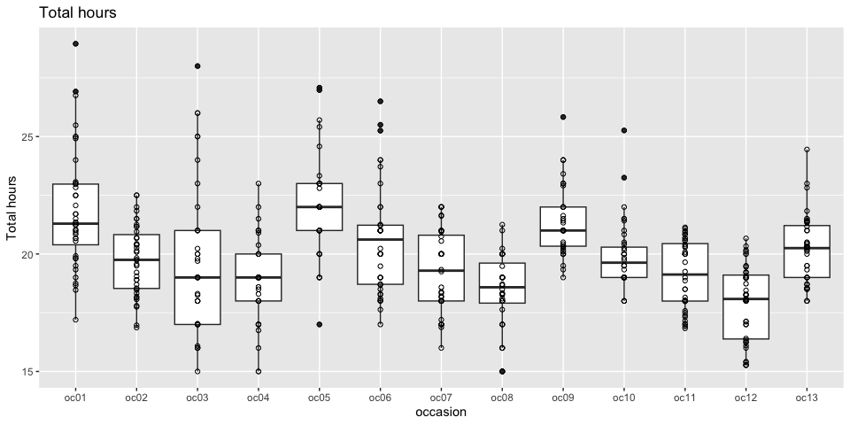
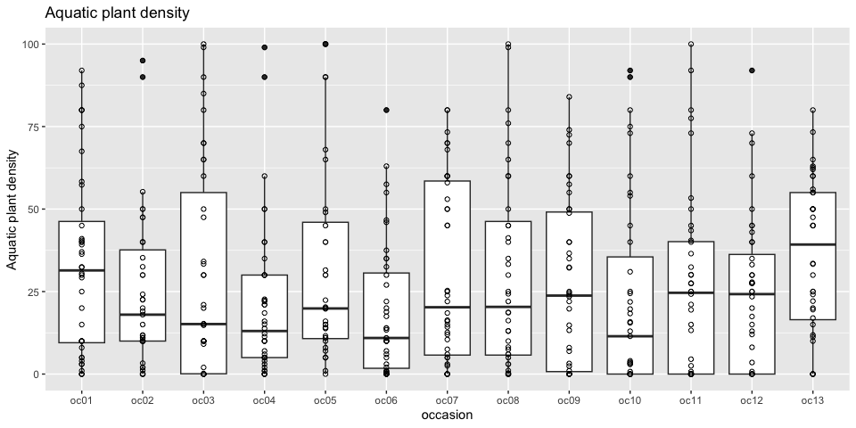

Seasonality
================

Here we explore the seasonality of the sampling.

``` r
drake::loadd(occasion_info)
drake::loadd(refuge_info)
```

``` r
# Function to plot a numeric variable
boxplot_occasion <- function(var){
  occasion_info %>%
    dplyr::select(-sampling) %>% 
    dplyr::distinct() %>%
    ggplot(aes_string(x = "occasion", y = var))  +
    geom_boxplot() +
    geom_point(shape = 21) +
    labs(y = snakecase::to_sentence_case(var), 
         title = snakecase::to_sentence_case(var))
}
# Loop over the numeric variables
vars <- colnames(occasion_info)[5:16]
purrr::map(vars, boxplot_occasion)
```

    ## [[1]]

<!-- -->

    ## 
    ## [[2]]

<!-- -->

    ## 
    ## [[3]]

<!-- -->

    ## 
    ## [[4]]

<!-- -->

    ## 
    ## [[5]]

    ## Warning: Removed 7 rows containing non-finite values (stat_boxplot).

    ## Warning: Removed 7 rows containing missing values (geom_point).

<!-- -->

    ## 
    ## [[6]]

<!-- -->

    ## 
    ## [[7]]

<!-- -->

    ## 
    ## [[8]]

<!-- -->

    ## 
    ## [[9]]

<!-- -->

    ## 
    ## [[10]]

<!-- -->

    ## 
    ## [[11]]

    ## Warning: Removed 1 rows containing non-finite values (stat_boxplot).

    ## Warning: Removed 1 rows containing missing values (geom_point).

<!-- -->

    ## 
    ## [[12]]

<!-- -->

Let’s have a closer look at the water level. But this time in
logarithmic scale because there is a large variability on the rice field
water levels among sites.

``` r
occasion_info %>%
  dplyr::select(-sampling) %>%
  dplyr::distinct() %>%
  dplyr::left_join(refuge_info, by = "refuge") %>%
  dplyr::mutate(occasion_numeric = as.numeric(stringr::str_extract(occasion, "[0-9]+")), 
                dry_season = (occasion_numeric %% 4) %in% c(2,3), 
                refuge = forcats::fct_reorder(refuge, as.numeric(factor(category_name)))) %>%
  ggplot(aes(x = occasion, y = rf_water_level, group = refuge, colour = category_name)) +
  geom_point(aes(colour = category_name)) +
  geom_line() +
  # scale_colour_manual(values = c("black", "red")) +
  scale_y_continuous(trans = "log1p", breaks = c(1,10,100)) +
  facet_wrap("refuge", ncol = 4) +
  theme(legend.position = "top", legend.direction = "vertical", 
        axis.text.x = element_text(angle = 90))
```

<!-- -->

We can see there is a lot of variation in the flooding patterns. Many
sites are flodded in both of the we season occasions consistently
throughout the years, but many miss the flood at least once or tice.
It’s apparent that including this factor somehow in the analysis might
become important when comparing and accounting for biodiversity in the
wet season in particular.

Flooding patterns do not seem to be at all related to the site
categories.

``` r
ri <- refuge_info %>%
  dplyr::select(refuge, province, category_name, large_water_body, type_inlet_outlet, 
                depth_wet_m, depth_dry_m, drought_freq, flooding_freq, rf_area_connected_in_dry_season_ha, 
                rf_area_connected_in_wet_season_ha)

pca_analysis <- occasion_info %>%
  dplyr::select(-sampling) %>%
  dplyr::distinct() %>%
  dplyr::select(refuge, occasion, rf_water_level) %>%
  dplyr::mutate(rf_water_level = log(rf_water_level + 1)) %>%
  tidyr::pivot_wider(id_cols = "refuge", values_from = "rf_water_level", names_from = "occasion") %>% 
  dplyr::mutate(dplyr::across(dplyr::everything(), tidyr::replace_na, 0)) %>% 
  dplyr::left_join(ri, , by = "refuge") %>% 
  as.data.frame() %>%
  magrittr::set_rownames(.$refuge) %>%
  dplyr::select(-refuge) %>% 
  FactoMineR::PCA(quali.sup = 14:17, quanti.sup = 18:23, graph = F)
```

    ## Warning in FactoMineR::PCA(., quali.sup = 14:17, quanti.sup = 18:23, graph =
    ## F): Missing values are imputed by the mean of the variable: you should use the
    ## imputePCA function of the missMDA package

``` r
factoextra::fviz_pca_ind(pca_analysis, habillage = "category_name", addEllipses = T)
```

<!-- -->
