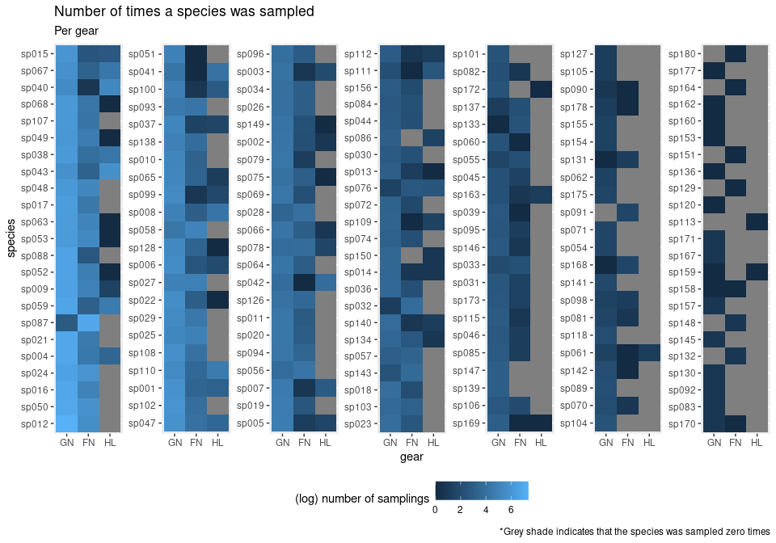

Sampling bias
================

The first step on the analysis is a better understanding of the data.
We’re particularly interested on knowing whether we should include
data from all gears and whether there are particular considerations when
analysing one gear or another.

We start by loading the catch data:

``` r
drake::loadd(catch_info)
```

First, we want to have a rough intuition about how big is the bias that
each gear has on species. For that, we plot the number of times a
species was sampled using a particular gear. The colour of the tiles in
the following plot show just that. Species are ordered by the number of
samples.

``` r
catch_info %>%
  dplyr::count(species, gear, .drop = F) %>% 
  tidyr::complete(species, gear, fill = list(n = 0)) %>% 
  dplyr::ungroup() %>%
  dplyr::mutate_at(vars(gear, species), ~ forcats::fct_reorder(., n, .fun = sum, .desc = T)) %>%
  dplyr::mutate(group = cut(as.numeric(species), 7)) %>% 
  ggplot() +
  geom_tile(aes(y = species, x = gear, fill = log(n))) +
  facet_wrap("group",nrow = 1, scales = "free_y") +
  theme(legend.position = "bottom", strip.text = element_blank()) +
  labs(fill = "(log) number of samplings", 
       title = "Number of times a species was sampled", 
       subtitle = "Per gear", 
       caption = "*Grey shade indicates that the species was sampled zero times")
```

<!-- -->

We can see that most species were captured at least once by the gill net
(GN). Only a handful of species were captured by fike traps (FN) or hook
lines (HL) alone.

A second consideration is the consistency and frequency of sampling. We
want to better understand whether there are gaps in the data that might
prove problematic in subsequent analysis.

To inspect that we plot the number of species found in every sampling
replicate. In the plot below we can see that information. Importantly,
when no species where found (for example because sampling wasn’t
performed) we show that as grey.

``` r
# Helper function to order factors in plot
n_zeros <- function(x){sum(x == 0)}
catch_info %>%
  dplyr::count(refuge, occasion, replicate, gear) %>%
  tidyr::complete(refuge, occasion, replicate, gear, fill = list(n = 0)) %>%
  dplyr::mutate_at(vars(refuge, gear), ~ forcats::fct_reorder(., n, .fun = n_zeros, .desc = F)) %>%
  ggplot() +
  geom_tile(aes(y = refuge, x = replicate, fill = log(n))) +
  facet_grid(gear ~ occasion) +
  theme(legend.position = "bottom", axis.text.x = element_text(angle = 90)) +
  labs(fill = "(log) number of species", 
       title = "Number of species sampled", 
       subtitle = "Per site, ocassion, replicate, and fishing method",
       caption = "*Grey shade indicares no species were found, or no sampling was performed.")
```

<!-- -->

We can see several patterns we would like to further investigate:

  - Six sites have been consistently sampled five times (instead of 8).
    These are the ones with id 12, 26, 28, 31, 32, and 35. After
    checking the monitoring protocol it became apparent that these sites
    correspond to the smallest refuges and therefore less samples were
    performed.
  - Data seems to be particularly patchy in occasion 3 (May 2013), but
    the number of species appears to be generally lower in occasions
    corresponding to May and August. These samplings correspond to the
    dry season and lower catches are to be expected.
  - No species were recorded for site 15 (Boeng Tramses) in occasion 2
    and 3 (Feb and May 2013).

## Take aways

  - Analyse only gill net data
  - If feasible, correct for differences in sampling among areas. This
    could potentially be done be done in a variety of ways depending on
    the analysis performed: averaging (instead of adding) across
    replicates, including a covariate of sampling in a statistical model
    (refuge area or replicate number), or even just taking care when
    interpreting the results from these sites.
